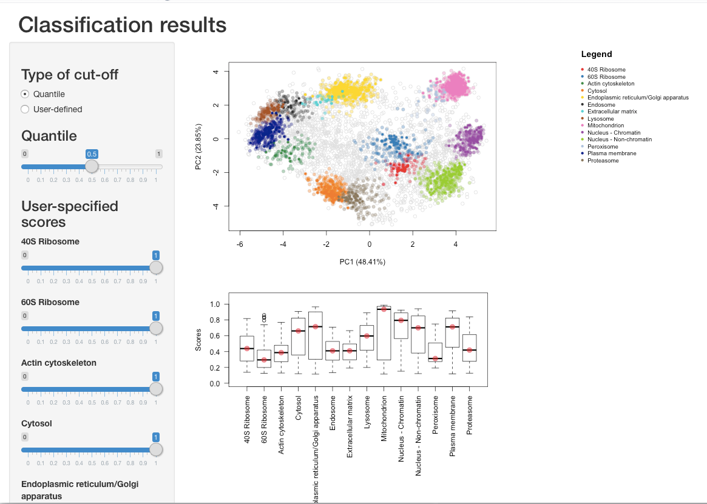

Introduction {#introduction .unnumbered}
============

Quantitative mass spectrometry based spatial proteomics involves
elaborate, expensive and time consuming experimental procedures and
considerable effort is invested in the generation of such data. Multiple
research groups have described a variety of approaches to establish high
quality proteome-wide datasets. However, data analysis is as critical as
data production for reliable and insightful biological interpretation.
Here, we walk the reader through a typical pipeline for the analysis of
such data using several Bioconductor packages for the R statistical
programming environment.

The main package to analyse protein localisation data is , which offers
a set of dedicated functions for the analysis of such data. itself
relies on to manipulate and process quantitative proteomics data. Many
other packages are used by for clustering, classification and
visualisation.

In this workflow, we will describe how to prepare the spatial proteomics
data starting from a spreadsheet containing quantitative mass
spectrometry data. We will focus on a recent pluripotent mouse embryonic
stem cells experiment @hyper. These data, as well as additional
annotated and pre-formatted datasets from various species are readily
available in the package.

Installation of Bioconductor package is documented in details on the
[Bioconductor installation help
page](http://bioconductor.org/install/#install-bioconductor-packages).
This procedure is also applicable to any packages, from
[CRAN](https://cran.r-project.org/) as well as GitHub. Once a package
has been installed, it needs to be loaded for its functionality to
become available in the R session; this is done with the `library`
function e.g. to load the one would type `library(pRoloc)` after
installation.

If you have questions about this workflow in particular, or about other
Bioconductor packages in general, they are best asked on the
[Bioconductor support site](https://support.bioconductor.org/) following
the [posting
guidelines](http://www.bioconductor.org/help/support/posting-guide/).
Questions can be tagged with specific package names or keywords. For
more general information about mass spectrometry and proteomics, the
readers are invited to read the package vignettes and associated papers
@Gatto:2014 [@Gatto:2015].

Reading and processing spatial proteomics data {#reading-and-processing-spatial-proteomics-data .unnumbered}
==============================================

The use-case: predicting sub-cellular localisation in pluripotent embryonic mouse stem cells {#the-use-case-predicting-sub-cellular-localisation-in-pluripotent-embryonic-mouse-stem-cells .unnumbered}
--------------------------------------------------------------------------------------------

As a use-case, we analyse a recent high-throughput spatial proteomics
dataset from pluripotent mouse embryonic stem cells (E14TG2a) @hyper.
The data was generated using hyperplexed LOPIT (hyperLOPIT), a
state-of-the-art method relying on improved sub-cellular fractionation
and more accurate quantitation, leading to more reliable classification
of protein localisation across the whole sub-cellular space. The method
uses an elaborate sub-cellular fractionation scheme, enabled by the use
of Tandem Mass Tag (TMT) @Thompson:2003 10-plex and application of the
MS data acquisition technique named synchronous precursor selection
MS$^3$ (SPS-MS$^3$) @McAlister:2014, for TMT quantification with high
accuracy and precision. Three biological replicates were generated from
the E14TG2a experiment, the first was to target low density fractions
and the second and third were to emphasis separation of the denser
organelles. The intersect of replicates 1 and 2 was treated as a 20-plex
dataset for the analysis. As discussed in the manuscript @hyper, it has
been shown that combining replicates across from different gradients can
increase spatial resolution @Trotter:2010. The combination of replicates
resulted in 5032 proteins common in both experiments.

These, as well as many other data are directly available as properly
structured and annotated computational object from the experiment
package. In this workflow, we will start with a description of how to
generate these ad hoc objects starting from an arbitrary spreadsheets,
as produced by many popular third-party applications.

While we focus here on a LOPIT-type dataset, these analyses are relevant
for any quantitative spatial proteomics data, irrespective of the
fractionation or quantitation (i.e. labelled or label-free) methods.

The infrastructure: `pRoloc` and `MSnbase` packages {#the-infrastructure-proloc-and-msnbase-packages .unnumbered}
---------------------------------------------------

To make use of the full functionality of the software one needs to
import their data into R and prepare them as an `MSnSet`. The `MSnSet`
is a dedicated data structure for the efficient manipulation and
processing of mass spectrometry and proteomics data in R. Figure 1
illustrates a simplified view of the `MSnSet` structure; there exists 3
key sub-parts (termed slots) to such a data object: (1) the `exprs`
(short for *expression* data) slot for storing the quantitation data,
(2) the `fData` slot (short for *feature*-metadata) for storing the
feature meta-data, and finally (3) the `pData` slot (short for
*pheno*-metadata, i.e. sample phenotypic data) for storing the sample
meta-data.

[fig:msnset]

Importing data {#importing-data .unnumbered}
--------------

There are a number of ways to import quantitation data and create an
`MSnSet` instance. All methods are described in the [input/output
capabilities
vignette](http://bioconductor.org/packages/release/bioc/vignettes/MSnbase/inst/doc/MSnbase-io.pdf).
One suggested simple method is to use the function `readMSnSet2`. The
function takes a single spreadsheet filename as input and extracts the
columns containing the quantitation data, as identified by the argument
`ecol`, to create the expression data, while the other columns in the
spreadsheet are appended to the feature meta-data slot. By example, in
the code chunk below we read in the `csv` spreadsheet containing the
quantitation data from the intersect of replicates 1 and 2 of the mouse
map @hyper, using the `readMSnSet2` function. The data is as available
online with the manuscript (see tab 2 of the `xlsx` supplementary data
set 1 in @hyper, which should be exported as a text-based spreadsheet).
It is also available as a `csv` in the Bioconductor data package, which
we make use of below.

To use the `readMSnSet2` function, as a minimum one must specify the
file path to the data and which columns of the spreadsheet contain
quantitation data. The `getEcols` function exists to help users identify
which columns of the spreadsheet contain the quantitation data. In the
last line of the code chunk below, we print the file name (not the full
path, which will vary from computer to computer).

\
`     `\
`     `\
`            `\

    ## [1] "hyperLOPIT-SIData-ms3-rep12-intersect.csv.gz"

Note that the file is compressed (as indicated by the `gz`, for `gzip`,
extension), and will be decompressed on-the-fly when read into R.

The spreadsheet that was deposited by the authors contains two headers,
with the second header containing information about where the
quantitation data is stored.

[fig:spreadsheet]

We can display the names of the second header by calling the `getEcols`
function with the argument `n = 2` (the default value is `n = 1`), to
specify that we wish to display the column names of the second line.

`      `

    ##  [1] ""                                 
    ##  [2] ""                                 
    ##  [3] ""                                 
    ##  [4] "Experiment 1"                     
    ##  [5] "Experiment 2"                     
    ##  [6] "Experiment 1"                     
    ##  [7] "Experiment 2"                     
    ##  [8] "126"                              
    ##  [9] "127N"                             
    ## [10] "127C"                             
    ## [11] "128N"                             
    ## [12] "128C"                             
    ## [13] "129N"                             
    ## [14] "129C"                             
    ## [15] "130N"                             
    ## [16] "130C"                             
    ## [17] "131"                              
    ## [18] "126"                              
    ## [19] "127N"                             
    ## [20] "127C"                             
    ## [21] "128N"                             
    ## [22] "128C"                             
    ## [23] "129N"                             
    ## [24] "129C"                             
    ## [25] "130N"                             
    ## [26] "130C"                             
    ## [27] "131"                              
    ## [28] "phenoDisco Input"                 
    ## [29] "phenoDisco Output"                
    ## [30] "Curated phenoDisco Output"        
    ## [31] "SVM marker set"                   
    ## [32] "SVM classification"               
    ## [33] "SVM score"                        
    ## [34] "SVM classification (top quartile)"
    ## [35] "Final Localization Assignment"    
    ## [36] "First localization evidence?"     
    ## [37] "Curated Organelles"               
    ## [38] "Cytoskeletal Components"          
    ## [39] "Trafficking Proteins"             
    ## [40] "Protein Complexes"                
    ## [41] "Signaling Cascades"               
    ## [42] "Oct4 Interactome"                 
    ## [43] "Nanog Interactome"                
    ## [44] "Sox2 Interactome"                 
    ## [45] "Cell Surface Proteins"

It is now easy for one to identify that the quantitation data,
corresponding to the 10 TMT isobaric tags, is located in columns 8 to
27. We now have the two mandatory arguments to `readMSnSet2`, namely the
file name (stored in the `csvfile` variable) and the quantitation column
indices. In addition to these, it is also possible to pass the optional
argument `fnames` to indicate which column to use as the labels by which
to identify each protein in the sample. Here, we use `fnames = 1` to use
the UniProt identifiers contained in the first (unnamed) column of the
spreadsheet. We also need to specify to skip the first line of the file
(for the same reason that we used `n = 2` in `getEcols` above) to read
the `csv` data and convert it to an `MSnSet` object, named `hl` (for
hyperLOPIT).

`           `

Below, we display a short summary of the data. The data contains 5032
proteins/features common across the 2 biological replicates for the
respective 2 x 10-plex reporter tags (20 columns/samples), along with
associated feature meta-data such as protein markers, protein
description, number of quantified peptides etc (see below).

    ## MSnSet (storageMode: lockedEnvironment)
    ## assayData: 5032 features, 20 samples 
    ##   element names: exprs 
    ## protocolData: none
    ## phenoData: none
    ## featureData
    ##   featureNames: Q9JHU4 Q9QXS1-3 ... Q9Z2R6 (5032 total)
    ##   fvarLabels: X X.1 ... Cell.Surface.Proteins (25 total)
    ##   fvarMetadata: labelDescription
    ## experimentData: use 'experimentData(object)'
    ## Annotation:  
    ## - - - Processing information - - -
    ##  MSnbase version: 2.0.0

Below, we examine the quantitative information for first 5 proteins. It
is also possible to access specific rows and columns by naming the
proteins and TMT tag channels of interest.

    ##           X126 X127N X127C X128N X128C X129N X129C X130N X130C  X131
    ## Q9JHU4   0.028 0.034 0.024 0.014 0.026 0.045 0.107 0.341 0.059 0.321
    ## Q9QXS1-3 0.039 0.134 0.095 0.053 0.084 0.121 0.107 0.128 0.122 0.117
    ## Q9ERU9   0.021 0.013 0.014 0.009 0.024 0.054 0.116 0.257 0.209 0.284
    ## P26039   0.120 0.255 0.148 0.091 0.135 0.095 0.041 0.057 0.014 0.043
    ## Q8BTM8   0.055 0.139 0.078 0.050 0.077 0.098 0.093 0.171 0.079 0.160
    ##          X126.1 X127N.1 X127C.1 X128N.1 X128C.1 X129N.1 X129C.1 X130N.1
    ## Q9JHU4    0.037   0.064   0.058   0.059   0.067   0.078   0.140   0.208
    ## Q9QXS1-3  0.033   0.073   0.074   0.062   0.081   0.142   0.190   0.069
    ## Q9ERU9    0.026   0.017   0.023   0.029   0.039   0.071   0.105   0.171
    ## P26039    0.111   0.181   0.141   0.144   0.152   0.119   0.075   0.028
    ## Q8BTM8    0.062   0.108   0.091   0.086   0.099   0.111   0.117   0.095
    ##          X130C.1 X131.1
    ## Q9JHU4     0.141  0.147
    ## Q9QXS1-3   0.151  0.125
    ## Q9ERU9     0.304  0.215
    ## P26039     0.017  0.033
    ## Q8BTM8     0.144  0.087

`   `

    ##         X126 X131.1
    ## Q9ERU9 0.021  0.215
    ## Q9Z2R6 0.563  0.000

The feature meta-data is stored in the `fData` slot and can be accessed
by `fData(hl)`. When using `readMSnSet2`, automatically, everything that
is not defined as quantitation data by `ecol` or the feature names by
`fnames` is deposited to the `fData` slot.

We see the `fData` contains 25 columns describing information such as
the number of peptides, associated markers, machine learning results
etc. To identify the feature variable names we can use the function
`fvarLabels`. We see that the first 6 feature variable names contain
non-discriminatory label names, so we relabel them to help us identify
what feature data information is stored in the associated columns.

    ##  [1] "X"                                
    ##  [2] "X.1"                              
    ##  [3] "X.2"                              
    ##  [4] "Experiment.1"                     
    ##  [5] "Experiment.2"                     
    ##  [6] "Experiment.1.1"                   
    ##  [7] "Experiment.2.1"                   
    ##  [8] "phenoDisco.Input"                 
    ##  [9] "phenoDisco.Output"                
    ## [10] "Curated.phenoDisco.Output"        
    ## [11] "SVM.marker.set"                   
    ## [12] "SVM.classification"               
    ## [13] "SVM.score"                        
    ## [14] "SVM.classification..top.quartile."
    ## [15] "Final.Localization.Assignment"    
    ## [16] "First.localization.evidence."     
    ## [17] "Curated.Organelles"               
    ## [18] "Cytoskeletal.Components"          
    ## [19] "Trafficking.Proteins"             
    ## [20] "Protein.Complexes"                
    ## [21] "Signaling.Cascades"               
    ## [22] "Oct4.Interactome"                 
    ## [23] "Nanog.Interactome"                
    ## [24] "Sox2.Interactome"                 
    ## [25] "Cell.Surface.Proteins"

`    `\
`   `\
` `

    ##          uniprot.accession  uniprot.id
    ## Q9JHU4              Q9JHU4 DYHC1_MOUSE
    ## Q9QXS1-3          Q9QXS1-3  PLEC_MOUSE
    ## Q9ERU9              Q9ERU9  RBP2_MOUSE
    ## P26039              P26039  TLN1_MOUSE
    ##                                                                                                                                 description
    ## Q9JHU4                                              Cytoplasmic dynein 1 heavy chain 1 OS=Mus musculus GN=Dync1h1 PE=1 SV=2 - [DYHC1_MOUSE]
    ## Q9QXS1-3 Isoform PLEC-1 of Plectin OS=Mus musculus GN=Plec - [PLEC_MOUSE]|Isoform PLEC-1A of Plectin OS=Mus musculus GN=Plec - [PLEC_MOUSE]
    ## Q9ERU9                                                     E3 SUMO-protein ligase RanBP2 OS=Mus musculus GN=Ranbp2 PE=1 SV=2 - [RBP2_MOUSE]
    ## P26039                                                                             Talin-1 OS=Mus musculus GN=Tln1 PE=1 SV=2 - [TLN1_MOUSE]
    ##          peptides.expt1 peptides.expt2 peptides.expt3
    ## Q9JHU4              175            166            322
    ## Q9QXS1-3            123            150            174
    ## Q9ERU9              101             90            181
    ## P26039              101             94            167

Note that when using the simple `readMSnSet2` procedure, the `pData`
slot which is used to store information about the samples/channels is
kept empty. It is advised to annotate the channels as well. Below, we
annotate the replicate from which the profiles originate and the TMT tag
(extracted from the sample/channel names).

`     `\
`      `\

    ##         Replicate  Tag
    ## X126            1  126
    ## X127N           1 127N
    ## X127C           1 127C
    ## X128N           1 128N
    ## X128C           1 128C
    ## X129N           1 129N
    ## X129C           1 129C
    ## X130N           1 130N
    ## X130C           1 130C
    ## X131            1  131
    ## X126.1          2  126
    ## X127N.1         2 127N
    ## X127C.1         2 127C
    ## X128N.1         2 128N
    ## X128C.1         2 128C
    ## X129N.1         2 129N
    ## X129C.1         2 129C
    ## X130N.1         2 130N
    ## X130C.1         2 130C
    ## X131.1          2  131

Throughout this workflow we refer to the different columns that are
found in the `exprs` (expression data) slot as channels (short for TMT
channels). In the frame of LOPIT and hyperLOPIT these channels
consititue the relative abundance of each protein (along the rows) in
the channel of interest. Each TMT channel originates from fractions
collected from the density gradient, or a set of pooled fractions or may
be a sample originating from an alternative preparation e.g. such as
from the chromatin enrichment performed in Christoforou et al @hyper.
Information about which gradient fractions were used for which tag
should also be stored in the sample meta-data `pData` slot.

The sample meta-data that is distributed with the package for
Christoforou’s hyperLOPIT experiment and (as above) the quantitation
data file, are located in the `extdata` in the package on the hard
drive.

In the code chunk below we again use the `dir` function to locate the
filepath to the meta-data `csv` file and then read it into R using
`read.csv`. We then append the meta-data to the `pData` slot.
Information about the gradient fractions used and the associated
subcellular fraction densities in each replicate are stored here.

`     `\
`                 `\
\
`      `\
`                          `\
\
`    `\
`    `\

    ##         Replicate  Tag Gradient.Fraction Iodixonal.Density
    ## X126            1  126           Cytosol               0.0
    ## X127N           1 127N   1 to 6 (pooled)               6.0
    ## X127C           1 127C   8 to 9 (pooled)              11.0
    ## X128N           1 128N 10 to 11 (pooled)              13.3
    ## X128C           1 128C                12              14.6
    ## X129N           1 129N                14              17.4
    ## X129C           1 129C                16              20.1
    ## X130N           1 130N                18              26.8
    ## X130C           1 130C         Chromatin                NA
    ## X131            1  131                19              34.5
    ## X126.1          2  126           Cytosol               0.0
    ## X127N.1         2 127N   1 to 6 (pooled)               5.2
    ## X127C.1         2 127C   7 to 9 (pooled)              10.0
    ## X128N.1         2 128N 10 to 11 (pooled)              12.5
    ## X128C.1         2 128C                12              14.0
    ## X129N.1         2 129N 14 to 15 (pooled)              17.3
    ## X129C.1         2 129C                17              20.9
    ## X130N.1         2 130N 18 to 19 (pooled)              24.7
    ## X130C.1         2 130C         Chromatin                NA
    ## X131.1          2  131                20              31.9

Data processing {#data-processing .unnumbered}
---------------

### Normalisation {#normalisation .unnumbered}

There are two aspects related to data normalisation that are relevant to
spatial proteomics data processing. The first one focuses on reducing
purely technical variation between channels without affecting biological
variability (i.e. the shape of the quantitative profiles). This
normalisation will depend on the underlying quantitative technology and
the experimental design, and will not be addressed in this workflow. The
second aspect, and more specific to spatial proteomics data, is scaling
all the organelle-specific profiles into a same intensity interval
(typically 0 and 1) by, for example, diving each intensity by the sum of
the intensities for that quantitative feature. This is not necessary in
this example as the intensities for each replicate have already been
re-scaled to 1 in Proteome Discoverer. However, if one wanted to do this
they would execute the `normalise` function as demonstrated in the below
code chunk.

`     `

This transformation of the data assures to cancel the effect of the
absolute intensities of the quantitative features along the rows, to
focus subsequent analyses on the relative profiles along the
sub-cellular channels.

The same `normalise` function (or `normalize`, both spellings are
supported) can also be applied in the first case described above.
Different normalisation methods such as mean or median scaling, variance
stabilisation or quantile normalisation, to cite a few, can be applied
to accomodation different needs.

As previously mentioned, before combination, the two replicates in the
`hl` data that we read into R were separately normalised by sum (i.e. to
1) across the 10 channels for each replicate respectively. We can verify
this by summing each rows for each replicate:

`  `

    ##    Min. 1st Qu.  Median    Mean 3rd Qu.    Max. 
    ##   0.997   0.999   1.000   1.000   1.001   1.003

`  `

    ##    Min. 1st Qu.  Median    Mean 3rd Qu.    Max. 
    ##   0.997   0.999   1.000   1.000   1.001   1.003

We see that some features do not add up exactly to 1 due to rounding
errors after exporting to intermediate files. These small deviations do
not bear any consequences here.

### Combining acquisitions {#combining-acquisitions .unnumbered}

The spreadsheet that was used to create the `hl` MSnSet included the two
replicates within one .csv file. We also provide individual replicates
in the package. Below, we show how to combine `MSnSet` objects and,
subsequently, how to filter and handle missing values. We start by
loading the package and the equivalent replicates using the `data`
function.

\
\

At the R prompt, typing

will list the 54 datasets that are available in .

Combining data is performed with the `combine` function. This function
will inspect the feature and sample names to identify how to combine the
data. As we want our replicates to be combined along the columns (same
proteins, different sets of channels), we need to assure that the
respective sample names differ so they can be identified from one
another. The function `updateSampleNames` can be used do this.

` `

    ## [1] TRUE

`   `\
`   `\

    ##  [1] "X126.1"  "X127N.1" "X127C.1" "X128N.1" "X128C.1" "X129N.1" "X129C.1"
    ##  [8] "X130N.1" "X130C.1" "X131.1"

    ##  [1] "X126.2"  "X127N.2" "X127C.2" "X128N.2" "X128C.2" "X129N.2" "X129C.2"
    ##  [8] "X130N.2" "X130C.2" "X131.2"

In addition, to matching names, the content of the feature metadata for
identical feature annotations must match exactly across the data to be
combined. In particular for these data, we expect the same proteins in
each replicates to be annotated with the same UniProt entry names and
descriptions, but not with the same coverage of number of peptides or
peptide-spectrum matches (PSMs).

    ## [1] "EntryName"          "ProteinDescription" "Peptides"          
    ## [4] "PSMs"               "ProteinCoverage"    "markers"

    ## [1] "EntryName"          "ProteinDescription" "Peptides"          
    ## [4] "PSMs"               "ProteinCoverage"    "markers"

Below, we update the replicate specific feature variable names and
remove the shared annotation.

`   `\
`   `\
`  `\
`  `\

    ## [1] "EntryName"          "ProteinDescription" "Peptides1"         
    ## [4] "PSMs1"              "ProteinCoverage1"

    ## [1] "Peptides2"        "PSMs2"            "ProteinCoverage2"

We can now combine the two experiments into a single `MSnSet`:

`  `\

    ## MSnSet (storageMode: lockedEnvironment)
    ## assayData: 6725 features, 20 samples 
    ##   element names: exprs 
    ## protocolData: none
    ## phenoData
    ##   sampleNames: X126.1 X127N.1 ... X131.2 (20 total)
    ##   varLabels: Replicate TMT.Reagent ... Iodixonal.Density (5 total)
    ##   varMetadata: labelDescription
    ## featureData
    ##   featureNames: Q9JHU4 Q9QXS1-3 ... Q9Z2Y3-3 (6725 total)
    ##   fvarLabels: EntryName ProteinDescription ... ProteinCoverage2 (8
    ##     total)
    ##   fvarMetadata: labelDescription
    ## experimentData: use 'experimentData(object)'
    ## Annotation:  
    ## - - - Processing information - - -
    ## Combined [6725,20] and [6268,10] MSnSets Thu Nov  3 13:51:16 2016 
    ##  MSnbase version: 1.21.7

More details above combining data are given in the dedicated *Combining
MSnSet instances* section of the [tutorial
vignette](http://bioconductor.org/packages/release/bioc/vignettes/MSnbase/inst/doc/MSnbase-demo.pdf).

### Missing data {#missing-data .unnumbered}

Missing data are a recurrent issue in mass spectrometry applications,
and should be addressed independently of this workflow
@Webb-Robertson:2015 [@Lazar:2016]. In @Gatto:2014b, we have described
how a high content in missing values in spatial proteomics data and
their inappropriate handling leads to a reduction of sub-cellular
resolution. Missing data can be imputated using ’s `impute` function.
The method underlying the imputation method is then determined by a
`methods` parameter. In our particular case, missing values are
indicative of protein groups that were not acquired in both replicates
(Figures [fig:namap]).

`    `\
`         `

[fig:namap]

We prefer to remove proteins that were not assayed in both replicated
experiments. This is done with the `filterNA` function that removes
features that contain more than a certain proportion (default is 0)
missing values.

`  `\

    ## MSnSet (storageMode: lockedEnvironment)
    ## assayData: 5032 features, 20 samples 
    ##   element names: exprs 
    ## protocolData: none
    ## phenoData
    ##   sampleNames: X126.1 X127N.1 ... X131.2 (20 total)
    ##   varLabels: Replicate TMT.Reagent ... Iodixonal.Density (5 total)
    ##   varMetadata: labelDescription
    ## featureData
    ##   featureNames: Q9JHU4 Q9QXS1-3 ... Q9Z2R6 (5032 total)
    ##   fvarLabels: EntryName ProteinDescription ... ProteinCoverage2 (8
    ##     total)
    ##   fvarMetadata: labelDescription
    ## experimentData: use 'experimentData(object)'
    ## Annotation:  
    ## - - - Processing information - - -
    ## Combined [6725,20] and [6268,10] MSnSets Thu Nov  3 13:51:16 2016 
    ## Subset [6725,20][5032,20] Thu Nov  3 13:51:16 2016 
    ## Removed features with more than 0 NAs: Thu Nov  3 13:51:16 2016 
    ## Dropped featureData's levels Thu Nov  3 13:51:16 2016 
    ##  MSnbase version: 1.21.7

When more than 2 data are to be combined and too many proteins were not
consistently assayed, leading to too many proteins being filtered out,
we suggest to implement an ensemble of classifiers voting on
protein-sub-cellular niche membership over the output of several
experiments (see section *Supervised machine learning* for the
description of sub-cellular assignments).

Quality Control {#quality-control .unnumbered}
===============

Data quality is routinely examined through visualisation to verify that
sub-cellular niches have been separated along the gradient. Based on De
Duve’s principle @DeDuve:1981 proteins that co-localise exhibit similar
quantitation profiles across the gradient fractions employed. One
approach that has been widely used to visualise and inspect high
throughput mass spectrometry-based proteomics data is principal
components analysis (PCA). PCA is one of many dimensionality reduction
methods, that allow one to effectively summarise multi-dimensional data
in to 2 or 3 dimensions to enable visualisation. Very generally, the
original continuous multi-dimensional data is transformed into a set of
orthogonal components ordered according to the amount of variability
that they describe. The `plot2D` method in allows one to plot the
principal components (PCs) of a dataset against one another, by default
the first two components are plotted on the x- and y-axis, respectively
(the `dims` argument can be used to plot other PCs). If distinct
clusters are observed, we assume that there is organellar separation
present in the data. Although, representing the multi-dimensional data
along a limited set of PCs does not give us a hard quantitative measure
of separation, it is extremely useful summarising complex experimental
information in one figure, to get an simplified overview of the data.

In the code chunk below we produce a PCA plot of the mouse stem cell
dataset (Figure [fig:pcahl]). One point on the plot represents one
protein. We can indeed see several distinct protein clusters. We specify
`fcol = NULL`, which means not to consider any feature variable to
annotate the features (proteins) with colours. We will see later how to
use this to annotate the PCA plot with prior information about
sub-cellular localisation.

\
`      `

[fig:pcahl]

In the first instance we advise one to visualise their data without any
annotation (i.e. with `fcol = NULL`), before proceeding with data
annotation. The identification of well resolved clusters in the data,
constitutes an unbiased assessment of the data structure, demonstrating
the successful separation of sub-cellular clusters.

It is also useful to visualise the relative intensities along the
gradient to identify channels displaying particularly low yield. This
can be done using the `plotDist` and `boxplot` functions, that plot the
protein profiles occupancy along the gradient (we also display the mean
channel intensities) and a `boxplot` of the column intensities. In the
two plots displayed on figure [fig:qcbx], we re-order the TMT channles
to pair corresponding channels in the two replicates (rather than
ordering the channels by replicate).

`   `\
`  `\
`   `\
`      `\
`   `

[fig:qcbx]

Markers {#markers .unnumbered}
=======

In the context of spatial proteomics, a marker protein is defined as a
well-known resident of a specific sub-cellular niche in a species *and*
condition of interest. Applying this to machine learning (ML), and
specifically supervised learning, for the task of protein localisation
prediction, these markers constitute the labelled training data to use
as input to a classification analyses. Defining well-known residents,
and obtaining labelled training data for ML analyses can be time
consuming, but it is important to define markers that are representative
of the multivariate data space and on which a classifier will be trained
and generated. provides a convenience function, `addMarkers`, to
directly add markers to a `MSnSet` object, as demonstrated in the code
chunk below. These marker sets can be accessed using the
`pRolocmarkers()` function. Marker sets are stored as a simple named
vector in R, and originate from in-house user-defined sets of markers or
from previous published studies @Gatto:2014b, which are continuosly
updated and integrated.

\

    ## 7 marker lists available:
    ## Arabidopsis thaliana [atha]:
    ##  Ids: TAIR, 543 markers
    ## Drosophila melanogaster [dmel]:
    ##  Ids: Uniprot, 179 markers
    ## Gallus gallus [ggal]:
    ##  Ids: IPI, 102 markers
    ## Homo sapiens [hsap]:
    ##  Ids: Uniprot ID, 205 markers
    ## Mus musculus [mmus]:
    ##  Ids: Uniprot, 937 markers
    ## Saccharomyces cerevisiae [scer_sgd]:
    ##  Ids: SGD, 259 markers
    ## Saccharomyces cerevisiae [scer_uniprot]:
    ##  Ids: Uniprot Accession, 259 markers

These markers can then be mapped to a `MSnSet`’s `featureNames`. The
mouse dataset used here has Uniprot IDs stored as the `featureNames`
(see `head(featureNames(hl))`) and the names of the vector of the mouse
markers stored in (`mmus` markers) are also Uniprot IDs (see `head(mrk)`
in the code chunk below), so it is straightforward to match names
between the markers and the `MSnSet` instance using the `addMarkers`
function.

\
`    `\

    ##                 P26039                 Q6PB66                 P11276 
    ##   "Actin cytoskeleton"        "Mitochondrion" "Extracellular matrix" 
    ##                 Q6PR54                 Q05793                 P19096 
    ##  "Nucleus - Chromatin" "Extracellular matrix"              "Cytosol"

\
`  `

**

    ## organelleMarkers
    ##            40S Ribosome            60S Ribosome      Actin cytoskeleton 
    ##                      27                      43                      13 
    ##                 Cytosol   Endoplasmic reticulum                Endosome 
    ##                      43                      95                      12 
    ##    Extracellular matrix         Golgi apparatus                Lysosome 
    ##                      10                      27                      33 
    ##           Mitochondrion     Nucleus - Chromatin Nucleus - Non-chromatin 
    ##                     383                      64                      85 
    ##              Peroxisome         Plasma membrane              Proteasome 
    ##                      17                      51                      34 
    ##                 unknown 
    ##                    4095

We recommend at least 13 markers per sub-cellular class (see the
*Optimisation* section for details about the algorithmic motivation of
this number). Markers should be chosen to confidently represent to
distribution of genuine residents of a sub-cellular niche. We generally
recommend such a conservative approach in defining markers to avoid
false assignments when assigning sub-cellular localisation of proteins
of unknown localisation. A more relaxed definition of markers, i.e. one
that broadly or over-confidently defines markers, risks to erroneously
assign proteins to a single location, when, in reality, they reside in
more that a single location (including the assumed unique location). One
can not expect to identify exact boundaries between sub-cellular classes
through marker annotation alone; the definition of these boundaries is
better handled algorithmically, i.e. after application of the supervised
learning algorithm, using the prediction scores (as described in the
*Classification* section, in particular Figure [fig:plotSVM]).

If the naming between the marker sets and the `MSnSet` dataset are
different, one will have to convert and match the proteins according to
the appropriate identifier. Sometimes, we find the equivalent entry
name, Uniprot ID or accession number is stored with the data, which
makes conversion between identifers relatively straightforward. If this
is not the case however, conversion can be performed using , the
Bioconductor [annotation
resouces](http://bioconductor.org/help/workflows/annotation/Annotation_Resources/)
or any conversion softwares available online.

We now visualise these annotations along the PCA plot using the `plot2D`
function and then use the `addLegend` function to map the marker classes
to the pre-defined colours. We also display the data along the first and
seventh PCs using the `dims` argument. Note that in these calls to the
`plot2D` function, we have omitted the `fcol` argument and use of the
default `markers` feature variable to annotated the plot. We choose to
display PCs 1 and 7 to illustrate that while upper principal components
explain much less variability in the data (2.23% for PC7, as opposed to
48.41% for PC1), we see that the mitochondrial (purple) and peroxisome
(dark blue) clusters can be differenciated, despite the apparent overlap
in the two first PCs.

`   `\
`   `\
`   `\
`       `

[fig:plotmarkers]

The colours have been defined so as to enable to differenciate up to 30
classes. If more are provided, different character symbols (circles,
squares, ... and empty and solid symbols) are used. The colours and the
default plotting characters (solid dots for the markers and empty
circles for the features of unknown localisation) can of course be
changed, as described in the `setStockcol` manual page.

As demonstrated in @hyper and illustrated in the PCA plot above, the
Golgi apparatus proteins (brown) display a dynamic pattern, noting sets
of Golgi marker proteins that are distributed amongst other subcellular
structures, an observation supported by microscopy. As such, we are
going to reset the annotation of Golgi markers to unknown using the
`fDataTounknown` function. It is often used to replace empty strings
(“”) or missing values in the markers definition to a common definition
of *unknown* localisation.

`        `\

    ## organelleMarkers
    ##            40S Ribosome            60S Ribosome      Actin cytoskeleton 
    ##                      27                      43                      13 
    ##                 Cytosol   Endoplasmic reticulum                Endosome 
    ##                      43                      95                      12 
    ##    Extracellular matrix                Lysosome           Mitochondrion 
    ##                      10                      33                     383 
    ##     Nucleus - Chromatin Nucleus - Non-chromatin              Peroxisome 
    ##                      64                      85                      17 
    ##         Plasma membrane              Proteasome                 unknown 
    ##                      51                      34                    4122

In general, the Gene Ontology (GO) @Ashburner:2000, and in particular
the cellular compartment (CC) namespace are a good starting point for
protein annotation and marker definition. It is important to note
however that automatic retrieval of sub-cellular localisation
information, from or elsewhere, is only the beginning in defining a
marker set for downstream analyses. Expert curation is vital to check
that any annotation added is in the correct context for the biological
question under investigation.

Another useful visualisation that relies on marker annotation is the
representation of the protein profiles occupancy along the gradient
using the `plotDist` function. While the PCA plot enables to efficiently
visualise the complete dataset and assess the relative separation of
different sub-cellular niches, comparing profiles of a few marker
clusters is useful to assess how exactly they differ (in terms of peak
channels, for example). On figure [fig:plotDist2], we plot the profile
of the mitochondrial and peroxisome markers to highlight the differences
in profiles between these two sets of markers along the 6th and 7th
channels, as represented above along the 7th PC on the PCA plot on
figure [fig:plotmarkers].

`   `\
`  `\
`              `\
`  `\
`  `\
`                 `\
`  `\
`                `

[fig:plotDist2]

Finally, in addition to `plot2D`, the `plot3D` function allows to
interactively explore a 3-dimensional plot of the data.

Replication {#replication .unnumbered}
===========

With the aim of maximising the sub-cellular resolution and,
consequently, the reliability in protein sub-cellular assignments, we
follow the advice in @Trotter:2010 and combine replicated spatial
proteomics experiments as described above. Indeed, Trotter et al. have
shown a significant improvement in protein–organelle association upon
direct combination of single experiments, in particular when these
resolve different subcellular niches.

Direct comparisons of individual channels in replicated experiments does
not provide an adequate, goal-driven assessment of different
experiments. Indeed, due to the nature of the experiment and gradient
fraction collection, the quantitative channels do not correspond to
identical selected fractions along the gradient. As can be seen in the
table below (taken from the `hl`’s `pData`, focusing on channels 7 to
10), different sets of gradient fractions are pooled to obtain enough
material and optimise acurate quantitation.

              Replicate Tag    Gradient.Fraction     Iodixonal.Density
  --------- ----------- ------ ------------------- -------------------
      X127N           1 127N   1 to 6 (pooled)                    6.00
      X127C           1 127C   8 to 9 (pooled)                   11.00
      X128N           1 128N   10 to 11 (pooled)                 13.30
    X127C.1           2 127C   7 to 9 (pooled)                   10.00
    X128N.1           2 128N   10 to 11 (pooled)                 12.50

  : Differences in gradient fraction pooling.

[tab:pdtab]

The more relevant comparison unit is not a single channel, but rather
the complete protein occupancy profiles, which are best visualised as
experiment-wide on a PCA plot. As such, we prefer to focus on the
direct, qualitative comparison of individual replicate PCA plots,
assuring that each displays acceptable sub-cellular resolution. Note
that in the code chunk below, we mirror the x-axis to represent the two
figures with the same orientation.

`   `\
`     `\
`        `

[fig:plot2Drep]

Interactive visualisation {#interactive-visualisation .unnumbered}
=========================

Visualisation and data exploration is an important aspect of data
analyses allowing one to shed light on data structure and patterns of
interest. Using the package we can interactively visualise, explore and
interrogate quantitative spatial proteomics data. The package is
currently under active development and it relies on the `shiny`
framework for reactivity and interactivity. The package currently
distributes 3 different GUI’s (*main* (default), *compare* or *compare*)
which are wrapped and launched by the `pRolocVis` function. In the below
code chunk we lauch the main app (note, we do not need to specify the
argument, `app = main` as it is the default).

\

[fig:app]

As diplayed in the screenshot above, the *main* application is designed
for exploratory data analysis and is divied into 3 tabs: (1) PCA, (2)
Profiles and (3) Table selection. The default view upon loading is the
PCA tab, which features a clickable interface and zoomable PCA plot with
an interactive data table for displaying the quantitation information.
Particular proteins of interest can be highlighted using the text search
box. There is also an alternate profiles tab for visualisation of the
protein profiles, which can be used to examine the patterns of proteins
of interest. The Table selection tab provides an interface to control
data table column selection.

The *compare* application is useful for examining two replicate
experiments, or two experiments from different conditions, treatments
etc. The compare application is called by default if the input object to
`pRolocVis` is a `MSnSetList` of 2 `MSnSets`, but it can also be
specified by calling the argument `app = compare`. For example, in the
code chunk below we first create a `MSnSetList` of replicates 1 and 2 of
the hyperLOPIT data, this is then passed to `pRolocVis`.

\
\
`  `\
`   `

[fig:compare]

The comparison app loads the two PCA plots side-by-side. Only common
proteins between the two data sets are displayed. As per the main
application, proteins can be searched, identified and highlighted on
both PCA plots and in the dedicated profiles tab. One key feature of the
compare application is the ability to re-map the second dataset onto the
PCA data space of the first (reference) data set (see `?pRolocVis` and
the argument `remap = TRUE`). Using the first dataset as the reference
set, PCA is carried out on the first dataset and the standard deviations
of the principal components (i.e. the square roots of the eigenvalues of
the covariance/correlation matrix) and the matrix of variable loadings
(i.e. a matrix whose columns contain the eigenvectors) are stored and
then used to calculate the principal components of the second dataset.
Both datasets are scaled and centered in the usual way. The first
dataset appears on the left, and the second re-mapped data appears on
the right. The order of the first (the reference data for remapping) and
second dataset can be changed through regeneration/re-ordering of the
`MSnSetList` object.

The final application *classify*, has been designed to view machine
learning classification results according to user-specified thresholds
for the assignment of proteins to its sub-cellular location, as
discussed later in the subsection *thresholding* in the *supervised
machine learning section*.

Novelty Detection {#novelty-detection .unnumbered}
=================

The extraction of sub-cellular protein clusters can be difficult owing
to the limited number of marker proteins that exist in databases and
elsewhere. Furthermore, given the vast complexity of the cell, automatic
annotation retrieval does not always give a full representation of the
true sub-cellular diversity in the data. For downstream analyses, such
as supervised machine learning, it is desirable to obtain reliable
markers that cover as many sub-cellular niches as possible, as these
markers are directly used in the training phase of the ML
classification. We find that a lack of sub-cellular diversity in the
labelled training data leads to prediction errors, as unlabelled
instances can only be assigned to a class that exists in the training
data @Breckels:2013. In such scenarios, novelty detection can be useful
to identify data-specific sub-cellular groupings such as organelles and
protein complexes. The phenotype discovery (phenoDisco) algorithm
@Breckels:2013 is one such method and is available in . It is an
iterative semi-supervised learning method that combines the
classification of proteins on existing labelled data with the detection
of new clusters.

In addition to extracting new phenotypes, novelty detection methods are
also useful for confirming the presence of known or postulated clusters
in an unbiased fashion. For example, in @hyper the `phenoDisco`
algorithm was used to confirm the data-specific presence of the nucleus
and nucleus sub-compartments. In the code chunk below, we demonstrate
how to do this analysis, highlighting some of the optional arguments and
parameters available for phenotype extraction and give some advice on
how to interpret the output.

As the `phenoDisco` algorithm is semi-supervised it uses both labelled
(markers) and unlabelled data to explore the data structure and find new
sub-cellular data clusters. Thus the first step is to define some input
labelled data i.e. markers, that the algorithm will use as input for the
supervised learning aspect of the algorithm. As described in @hyper we
define a set of markers to use as input for the analyses that cover
well-known residents from three distinct organelle structures; the
mitochondria, plasma membrane and ER, and from three well-known and
abundant protein complexes; the proteasome and two ribosomal subunits,
40S and 60S. These input markers are stored in the `featureData` column
of `hl` where `fcol = phenoDisco.Input`. We can use the convenience
accessor function `getMarkers` to print out a table of the markers
contained in this marker set. These initial markers were manually
curated using information from the UniProt database, the Gene Ontology
and the literature.

`   `

    ## organelleMarkers
    ##                          40S Ribosome 
    ##                                    26 
    ##                          60S Ribosome 
    ##                                    43 
    ## Endoplasmic reticulum/Golgi apparatus 
    ##                                    76 
    ##                         Mitochondrion 
    ##                                   261 
    ##                       Plasma membrane 
    ##                                    50 
    ##                            Proteasome 
    ##                                    34 
    ##                               unknown 
    ##                                  4542

In the code chunk below we show how to run the `phenoDisco` function and
return a novelty detection result, according to the specified
parameters. The algorithm parameters `times`, `GS` and `p` are passed to
the function, along with the `fcol` to tell the algorithm where the
input training data is contained.

\
`           `

Note: We do not evaluate this code chunk in this document as the
algorithm is computational intensive and best parallelised over multiple
workers. This phenoDisco analysis took  24 hours to complete when
parallelised over 40 workers.

The argument `times` indicated the number of times we run unsupervied
Gaussian Mixture Modelling before defining a new phenotype cluster. The
recommended minimum and default value is 100. In the above code chunk we
increase the value to `times = 200` as we have found for larger datasets
(e.g. 5000+ proteins) a higher times is requried for convergence. `GS`
defines the minimum number of proteins allowed per new data cluster and
thus heavily influences what type of new clusters are extracted. For
example, if a user is interesed in the detection of small complexes they
may wish to use a small `GS = 10`, or `= 20` etc. If they wish to detect
larger, more abundant sub-cellular niches a much higher `GS` would be
preferable. Specifying a small `GS` can be more time consuming than
using a larger `GS`, and there is a trade off between finding
interesting small complexes and those that may not be of interest as we
find there is a tendancy to find more noise when using a small `GS`
compared to using a higher one.

One may also consider increasing the search space for new data clusters
by increasing the value of the parameter `G`. This defines the number of
GMM components to test and fit; the default is `G = 1:9` (the default
value in the
[*mclust*](https://cran.r-project.org/web/packages/mclust/index.html)
package @mclust). One should note that the decreasing the `GS`, and
increasing the values of the arguments `times`, `G` (among other
function arguments, see `?phenoDisco`) will heavily influence (increase)
the total time taken to run the algorithm. `phenoDisco` supports
parallelisation and we strongly suggest you make use of a parallel
processing to run these analyses.

The ouput of running the `phenoDisco` algorithm is an `MSnSet`
containing the new data clusters, appended to the `featureData` under
the name `pd`. We can see by typing `processingData(hl)` directly into
the console the processing information has been updated to the `MSnSet`
recording the parameters that were used to run the analyses. This is
handy for keeping track of data analyses. The results can be displayed
by using the `getMarkers` function. We see that 5 new phenotype data
clusters were found.

    ## MSnSet (storageMode: lockedEnvironment)
    ## assayData: 5032 features, 20 samples 
    ##   element names: exprs 
    ## protocolData: none
    ## phenoData
    ##   sampleNames: X126 X127N ... X131.1 (20 total)
    ##   varLabels: Replicate Tag Gradient.Fraction Iodixonal.Density
    ##   varMetadata: labelDescription
    ## featureData
    ##   featureNames: Q9JHU4 Q9QXS1-3 ... Q9Z2R6 (5032 total)
    ##   fvarLabels: uniprot.accession uniprot.id ... pd (27 total)
    ##   fvarMetadata: labelDescription
    ## experimentData: use 'experimentData(object)'
    ## Annotation:  
    ## - - - Processing information - - -
    ## Added markers from  'mrk' marker vector. Thu Nov  3 13:51:18 2016 
    ## Added markers from  'pdres' marker vector. Thu Nov  3 13:51:18 2016 
    ##  MSnbase version: 2.0.0

`   `

    ## organelleMarkers
    ##                          40S Ribosome 
    ##                                   106 
    ##                          60S Ribosome 
    ##                                    95 
    ## Endoplasmic reticulum/Golgi apparatus 
    ##                                   393 
    ##                         Mitochondrion 
    ##                                   525 
    ##                           Phenotype 1 
    ##                                   300 
    ##                           Phenotype 2 
    ##                                   253 
    ##                           Phenotype 3 
    ##                                   203 
    ##                           Phenotype 4 
    ##                                    74 
    ##                           Phenotype 5 
    ##                                    91 
    ##                       Plasma membrane 
    ##                                   421 
    ##                            Proteasome 
    ##                                    92 
    ##                               unknown 
    ##                                  2479

\
`   `\
`  `\
`     `\
`  `\
`    `\
\
\
`   `\
`   `\
`            `\
`      `\
`        `\
`        `

[fig:plotPDres]

We can plot the results using the `plot2D` function (Figure
[fig:plotPDres]). The five new phenotype data clusters can be extracted
and examined. In the code chunk below we write the results to a .csv
file. We use the argument `fDataCols` to specify which columns of the
`featureData` to write.

`  `\
`         `

We can also examine the each phenotype intercatively and visualise their
protein profiles by using the `pRolocVis` function in the package. We
found that phenotype 1 was enriched in nucleus associated proteins,
phenotype 2 in chromatin associated proteins, phenotype 3 in cytosolic
and phenotypes 4 and 5 in lysosomal and endosomal proteins.

Supervised machine learning {#supervised-machine-learning .unnumbered}
===========================

Supervised machine learning, also known as classification, is an
essential tool for the assignment of proteins to distinct sub-cellular
niches. Using a set of labelled training examples i.e. markers, we can
train a machine learning classifier to learn a mapping between the data
i.e. the quantitative protein profiles, and a known localisation. The
trained classifier can then be used to predict the localisation of a
protein of unknown localisation, based on its observed protein profile.
To date, this method has been extensively used in spatial quantitative
proteomics to assign thousands of proteins to distinct sub-cellular
niches @hyper
[@Groen:2014; @Trotter:2010; @Hall:2009; @Dunkley:2006; @Tan:2009].

There are several classification algorithms readily available in , which
are documented in the dedicated [ machine learning techniques
vignette](http://bioconductor.org/packages/release/bioc/vignettes/pRoloc/inst/doc/pRoloc-ml.pdf).
We find the general tendancy to be that it is not the choice of
classifier, but the improper optimisation of the algorithmic parameters,
that limits classification accuracy. Before employing any classification
algorithm and generating a model on the training data, one must first
find the optimal parameters for the algorithm of choice.

Optimisation {#optimisation .unnumbered}
------------

In the code chunk below we use a Support Vector Machine (SVM) to learn a
classifier on the labelled training data. As previously mentioned, one
first needs to train the classifiers parameters before an algorithm can
be used to predict the class labels of the proteins with unknown
location. One of the most common ways to optimise the parameters of a
classifier is to partition the labelled data in to training and testing
subsets. In this framework parameters are tested via a grid search using
cross-validation on the training partition. The best parameters chosen
from the cross-validation stage are then used to build a classifier to
predict the class labels of the protein profiles on the test partition.
Observed and expected classication results can be compared, and then
used to assess how well a given model works by getting an estimate of
the classiers ability to achieve a good generalisation i.e. that is
given an unknown example predict its class label with high accuracy. In
, algorithmic performance is estimated using stratified 80/20
partitioning for the training/testing subsets respectively, in
conjuction with five-fold cross-validation in order to optimise the free
parameters via a grid search. This procedure is usually repeated 100
times and then the best parameter(s) are selected upon investigation of
classifier accuracy. We recommend a minimum of 13 markers per
sub-cellular class for stratified 80/20 partitioning and 5-fold
cross-validation; this allows a minimum of 10 examples for parameter
optimisation on the training partition i.e. 2 per fold for 5-fold
cross-validation, and then 3 for testing the best parameters on the
validation set.

Classifier accuracy is estimated using the macro F1 score, i.e. the
harmonic mean of precision and recall. In the code chunk below we
demonstrate how to optimise the free parameters, `sigma` and `cost`, of
a classical SVM classifier with a Gaussian kernel using the function
`svmOptimisation`. As the number of labelled instances per class varies
from organelle to organelle, we can account for class imbalance by
setting specific class weights when generating the SVM model. Below the
weights, `w` are set to be inversely proportional to the class
frequencies.

`     `

    ## organelleMarkers
    ##            40S Ribosome            60S Ribosome      Actin cytoskeleton 
    ##                      27                      43                      13 
    ##                 Cytosol   Endoplasmic reticulum                Endosome 
    ##                      43                      95                      12 
    ##    Extracellular matrix                Lysosome           Mitochondrion 
    ##                      10                      33                     383 
    ##     Nucleus - Chromatin Nucleus - Non-chromatin              Peroxisome 
    ##                      64                      85                      17 
    ##         Plasma membrane              Proteasome                 unknown 
    ##                      51                      34                    4122

`    `

\
`     `\
`                               `\
`                           `

As mentioned previously, we rely on the default feature variable
`markers` to define the class labels and hence can ommit it. To use
another feature variables, one need to explicitly specify its name using
the `fcol` argument (for example `fcol = markers2`).

The output `params` is an object of class `GenRegRes`; a dedicated
container for the storage of the design and results from a machine
learning optimisation. To assess classifier performance we can examine
the macro F1 scores and the most frequently chosen parameters. A high
macro F1 score indicates that the marker proteins in the test dataset
are consistently and correctly assigned by the the algorithm. Often more
than one parameter or set of parameters gives rise to the best
generalisation accuracy. As such it is always important to investigate
the model parameters and critically assess the best choice. The
`f1Count` function counts the number of parameter occurences above a
certain F1 value. The best choice may not be as simple as the parameter
set that gives rise to the highest macro F1 score and one must be
careful to avoid overfitting and to choose parameters wisely.

` `

    ##     4  8 16
    ## 0.1 1 10 89

The parameter optimistion results can also be visualised as a boxplot or
heatmap, as shown in figure [fig:visualisOptHide]. The `plot` method for
`GenRegRes` object shows the respective distributions of the 100 macro
F1 scores for the best cost/sigma parameter pairs, and `levelPlot` shows
the averaged macro F1 scores, for the full range of parameter values.

\

[fig:visualisOptHide]

By using the function `getParams` we can extract the best set of
parameters. Currently, `getParams` retrieves the first best set is
automatically but users are encouraged to critically assess whether this
is the most wise choice.

`  `

    ## sigma  cost 
    ##   0.1  16.0

Once we have selected the best parameters we can then use them to build
a classifier from the labelled marker proteins.

Classification {#classification .unnumbered}
--------------

We can use the function `svmClassification` to return a classification
result for all unlabelled instances in the dataset corresponding to
their most likely sub-cellular location. The algorithm parameters are
passed to the function, along with the class weights. As above, `fcol`
can be ignored as we use the labels defined in the default `markers`
feature variable.

`       `

Automatically, the output of the above classification, the organelle
predictions and assignment scores, are stored in the `featureData` slot
of the `MSnSet`. In this case, they are given the labels `svm` and
`svm.scores` for the predictions and scores respectively. The resultant
predictions can be visualised using `plot2D`. In the code chunk below
`plot2D` is called to generate a PCA plot of the data and `fcol` is used
to specify where the new assignments are located e.g. `fcol = svm`.

Additionally, when calling `plot2D` we can use the `cex` argument to
change the size of each point on the plot to be inversely proportional
to the SVM score. This gives an initial overview of the high scoring
localisations from the SVM predictions.

\
`    `\
\
`     `\
`            `

[fig:plotSVM]

The adjustment of the point size intuitively confers important
information that is more difficult to defined formally, but that we will
address in the next section. The classifier (SVM in our case, but this
is also valid of other classifiers) defines boundaries based on the
labelled marker proteins. These class/organelle boundaries define how
non-assigned proteins are classified and with what confidence.

Thresholding {#sec:thresholding .unnumbered}
------------

It is common when applying a supervised classification algorithm to set
a specific score cutoff on which to define new assignments, below which
classifications are kept unknown/unassigned. This is important as in a
supervised learning setup, proteins can only be predicted to be
localised to one of the sub-cellular niches that appear in the labelled
training data. We can not guarantee (and do not expect) that the whole
sub-cellular diversity to be represented in the labelled training data
as (1) finding markers that represent the whole diversity of the cell is
challenging (especially obtaining dual- and multiply-localised protein
markers) and (2) many sub-cellular niches contain too few proteins to
train on (see above for a motivation of a minimum of 13 markers).

Deciding on a threshold is not trivial as classifier scores are heavily
dependent upon the classifier used and different sub-cellular niches can
exhibit different score distributions, as highlighted in the boxplot
below. We recommend users to set class-specific thresholds. In the code
chunk below we display a boxplot of the score distributions per
organelle.

\
`  `\
\
`     `\
`     `\
`             `

[fig:threshold]

There are many ways to set thresholds and the choice of method will
depend on the biological question and experimental design at hand. One
viable approach in the frame of the above experimetal design would be to
manually set a FDR, say 5%, per organelle. To do this the user would
examine the top scoring predictions for each organelle, and then set a
threshold at the score at which they achieve 5% of false assignments per
organelle. The definintion of a false assignment would depend on the
information available, for example, validity or lack of validity for the
localisation from another experiment as reported in the literature or a
reliable database. If such information is not available, one crude
method is to set a threshold per organelle by extracting the median or
3rd quantile score per organelle. For example, in the code chunk below,
we use the `orgQuants` function to extract the median organelle scores
and then pass these scores to the `getPrediction` function to extract
the new localisations that meet this scoring criteria. Any sub-cellular
predictions that fall below the specified thresholds are labelled as
unknown.

`              `

    ##            40S Ribosome            60S Ribosome      Actin cytoskeleton 
    ##               0.4370276               0.3037353               0.3894744 
    ##                 Cytosol   Endoplasmic reticulum                Endosome 
    ##               0.6725203               0.6068444               0.4285221 
    ##    Extracellular matrix                Lysosome           Mitochondrion 
    ##               0.4158521               0.5893212               0.9492587 
    ##     Nucleus - Chromatin Nucleus - Non-chromatin              Peroxisome 
    ##               0.7938912               0.7081272               0.3134475 
    ##         Plasma membrane              Proteasome 
    ##               0.7168648               0.4195643

`             `

    ## ans
    ##            40S Ribosome            60S Ribosome      Actin cytoskeleton 
    ##                      85                     170                      89 
    ##                 Cytosol   Endoplasmic reticulum                Endosome 
    ##                     303                     476                      97 
    ##    Extracellular matrix                Lysosome           Mitochondrion 
    ##                      28                     124                     525 
    ##     Nucleus - Chromatin Nucleus - Non-chromatin              Peroxisome 
    ##                     229                     342                      38 
    ##         Plasma membrane              Proteasome                 unknown 
    ##                     317                     152                    2057

The output of `getPredictons` is the original `MSnSet` dataset with a
new feature variable appended to the feature data called `fcol.pred`
(i.e. in our case `svm.pred`) containing the prediction results. The
results can also be visualied using `plot2D` function.

`   `

[fig:plotres]

There is also a dedicated interactive application to help users examine
these distributions in the package. This app can be launched via the
`pRolocVis` function and specifying the argument `app = classify` along
with the relevent `fcol`, `scol` and `mcol` which refer to the columns
in the feature data that contain the new assignments, assignment scores
and markers respectively (see also `fvarLabels(svmres)`).

\
\
`            `\
`            `\
`                  `\
`            `

[fig:classifyapp]

The data is loaded and displayed on a PCA plot and a boxplot is used to
display the classifier scores by data class. On the left there is a
sidebar panel with sliders to control the thresholds upon which
classifications are made. There are two types of cut-off that the user
can choose from: (1) “Quantile” and (2) “User-defined”. By default, when
the application is launched quatile scoring is selected and set to 0.5,
the median. The class-specific score thresholds that correspond to
selecting the desired quantile are shown on as red dots on the boxplot.
The assignments on the PCA plot are also updated according to the
selected threshold. The quantile threshold can be set by moving the
corresponding quantile slider. If one wished to set their own cut-offs
the “User-defined” radio button must be selected and then the sliders
for defining user-specified scores become active and the scores and
highlighted on the boxplot by blue dots. For more information we refer
users to the tutorial
[vignette](http://bioconductor.org/packages/release/bioc/vignettes/pRolocGUI/inst/doc/pRolocGUI.html).

Transfer learning {#transfer-learning .unnumbered}
=================

In addition to high quality MS-based quantitative proteomics data there
exist a number of other sources of information that are freely available
in the public domain that may be useful to assign a protein to its
sub-cellular niche. For example, imaging from immunofluorescence
microscopy, protein annotations and sequences, and protein-protein
interactions among others, represent a rich and vast source of
complementary information. We can integrate this auxiliary information
with our primary MS-based quantitative data using a paradigm known as
transfer learning (TL). The integration of data between different
technologies is one of the biggest challenges in computational biology
to date and the package provides functionality to do such analyses. We
recently developed two transfer learning algorithms using a \*k\*-NN and
SVM framework and applied them to the task of protein localisation
prediction @Breckels:2016. In this section we will begin with explaining
the concept of transfer learning and then show how to apply this in the
frame of spatial proteomics and protein localisation prediction.

In TL one typically has a primary task that they wish to solve, and some
complementary (often heterogeneous) auxiliary information that is
related to the primary learning objective, that can be used to help
solve the primary goal. For example, here our primary task is to assign
proteins to their sub-cellular niche with high generalisation accuracy
from data collected from quantitative MS-based experiments. In the
example below we extract Gene Ontology (GO) information to use as an
auxiliary data source to help solve our task of protein localisation
prediction.

Using the functions `setAnnotationParams` and `makeGoSet` we can
contruct an auxiliary `MSnSet` of GO terms, from the primary data’s
features i.e. the protein accession numbers. All the GO terms associated
to each accession number are retrieved and used to create a binary
matrix where a 1 (0) at position (i; j) indicates that term j has (not)
been used to annotate protein i. The GO terms are retrieved from an
appropriate repository using the package. The specific Biomart
repository and query will depend on the species under study and the type
of identifiers. The first step is to construct the annotation parameters
that will enable to perform the query, this is done using
`setAnnotationParams`. Typing into the R console
`par <- setAnnotationParams()` will present two menus, firstly asking
you to identify the species of study, and then what type of identifier
you have used to annotate the proteins in your `MSnSet`. It is also
possible to pass patterns to match the species e.g. in the code chunk
below we pass “Mus musculus”, and the identifier type for our data (see
`featureNames(hl)`) which is “Uniprot/Swissprot”, for the Biomart query.

`    `\
`                                      `

Now we have contructed the query parameters we can use the `makeGoSet`
function to retrieve and build an auxiliary GO `MSnSet` as described
above. By default, the cellular component terms are downloaded, without
any filtering on evidence codes. It is also possible to download terms
from the molecular function and biological process GO namespaces, and
also apply filtering based on evidence codes as desired, see
`?makeGoSet` for more details.

`    `\
`                    `\
`                    `

The function `makeGoSet` uses the package to query the relevent database
(e.g. Ensembl, Uniprot) for GO terms. All GO terms that have been
observed for the 5032 proteins in the hyperLOPIT dataset are retieved.
Users should note that the number of GO terms retreived is also
dependent on the database version queried and thus is always subject to
change. We find it is common to see many GO terms with only one protein
assigned to that term, these such terms generally do not bring and
information generally for building the classifier and thus we can remove
such GO terms by using the function `filterBinMSnSet`.

`  `

Now we have generated our auxiliary data we can use the *k*-NN
implementation of transfer learning available in to integrate this with
our primary MS-based quantitative proteomics data using the functions
`knntlOptimisation` to estimate the free-parameters for the integration,
and `knntlClassification` to do the predictions. We have shown that
using transfer learning in the context of spatial proteomics results in
the assignment of proteins to sub-cellular niches with a higher
generalisation accuracy than using standard supervised machine learning
with a single source of information @Breckels:2016.

The first step, as with any machine learning algorithm, is to optimise
any free paramaters of the classifier. For the \*k\*-NN TL classifier
there are two sets of parameters that need optimising: the first set are
the $k$’s for the primary and auxiliary data sources required for the
nearest neighbour calculations for each data source. The second set of
parameters (which is noted by a vector of $\theta$ weights) that require
optimising are the class weights, one per subcellular niche, that
control the proportion of primary and auxiliary data to use for
learning. A weight can take any real value number between 0 and 1. A
weight of $\theta = 1$ indicates that all weight is given to the primary
data (and this implicitly implies that a weight of $1 - \theta$ is given
to the auxiliary data, similarly a weight of $\theta = 0$ implies that
all weight is given to the auxiliary data (so 0 is given to the primary
source). If we conduct a parameter seach and test weights
$\theta = {0, 1/3, 2/3, 1}$ for each class, and if we have, for example
10 subcellular niches, this will result in `4^{10}` different
combinations of parameters to test. The parameter optimisation is
therefore time consuming and as such we recommend you make use of a
computing cluster (code and submissing scripts are also available in the
supporting information). The markers in the `hl` dataset contain 14
subcellular classes. If we examine these markers and classes on the PCA
plot above we can see that in particular the two ribosomes and two
nuclear compartments are highly separated along the first two
components, this is also evident from the profiles plot which gives us a
good indication that these subcellular niches are well-resolved in the
hyperLOPIT dataset. Transfer learning is particularly useful for classes
that are not as well separated, we find that subcellular niches that are
well-separated under hyperLOPIT and LOPIT obtain a class score of 1
(i.e. use only primary data from transfer learning @Breckels:2016).
Therefore, for the optimisation stage of the analyses we can already
infer a subcellular class weight of 1 for these niches and only optimise
over the remaining organelles. This can signifciantly cut down
optimisation time as by removing these 4 classes from the optimisation
(and not the classification) we only have `4^{10}` class weight
combinations to consider instead of `4^{14}` combinations.

In the example below we remove these 4 classes from the marker set,
re-run the `knnOptimisation` for each data source and then run the
`knntlOptimisation` with the 10 remaining classes. (Note: this is not
run live as this the `hl` dataset with 10 classes, 707 markers and
4$^{10}$ combinations of parameters takes  76 hours to run on the
University of Cambridge HPC using 256 workers).

To remove the 4 classes and create a new column of markers in the
feature data called `tlmarkers` to use for the analysis:

\
`  `\
`  `\
\
\
`    `\
`           `\
`           `\
`   `\
`         `\
`         `\
\
`   `

    ##  [1] "Actin cytoskeleton"    "Cytosol"              
    ##  [3] "Endoplasmic reticulum" "Endosome"             
    ##  [5] "Extracellular matrix"  "Lysosome"             
    ##  [7] "Mitochondrion"         "Peroxisome"           
    ##  [9] "Plasma membrane"       "Proteasome"

`   `

    ##  [1] "Actin cytoskeleton"    "Cytosol"              
    ##  [3] "Endoplasmic reticulum" "Endosome"             
    ##  [5] "Extracellular matrix"  "Lysosome"             
    ##  [7] "Mitochondrion"         "Peroxisome"           
    ##  [9] "Plasma membrane"       "Proteasome"

Optimisation stage 1: run `knnOptimisation` to get the best $k$’s for
each data source.

\
`     `\
`     `\
\

From examining the parameter seach plots we find the best $k$’s for both
the primary and auxiliary are 3.

Optimisation stage 2: run `knntlOptimisation` to get the best transfer
learning weights for each sub-cellular class.

\
\
`     `\
\
\
`  `\
`                             `\
`                             `\
`                             `\
`                                 `\
`                            `

The results of the optimisation can be visalised using the `plot` method
for `ThetaRegRes` objects:

[fig:plottl]

Looking at the bubble plot displaying the distribution of best weights
over the 50 runs we find that for many of the subcellular niches a
weight of 1 is most popular (i.e. use only primary hyperLOPIT data in
classification), this is unsuprising as we already know the dataset is
well resolved for these classes. We see that the most popular weights
for the proteasome and lysosome tend to be towards 0, indicating that
these niches are well-resolved in the Gene Ontology. This tells us that
we would benefit from including auxiliary GO information in our
classifier for these subcellular compartments. The plasma membrane
weights are relatively equally spread between using hyperLOPIT and GO
data. Using the `getParams` function we can return the best weights and
then use this as input for the classification.

One of the benefits of the algorithm is the ability to manually select
weights for each class. In the optimisation above, for time constraints,
we removed the two ribosomal subunits and the two nulcear compartments,
and therefore in the code chunk below when we extract the best
parameters, these subcellular niches are not included. To include these
4 subcellular niches in the next classification step we must include
them in the parameters so we infer a weight of 1 for each of these
niches as we know they are well resolved in hyperLOPIT. We then re-order
the weights according to `getMarkerClasses` and perform the
classification using the function `knntlClassification`.

\
`  `

    ##    Actin cytoskeleton               Cytosol Endoplasmic reticulum 
    ##             1.0000000             1.0000000             0.6666667 
    ##              Endosome  Extracellular matrix              Lysosome 
    ##             1.0000000             1.0000000             0.3333333 
    ##         Mitochondrion            Peroxisome       Plasma membrane 
    ##             1.0000000             1.0000000             0.6666667 
    ##            Proteasome 
    ##             0.3333333

\
`   `\
`   `\
`                         `\
`                         `\
`  `

    ##      Actin cytoskeleton                 Cytosol   Endoplasmic reticulum 
    ##               1.0000000               1.0000000               0.6666667 
    ##                Endosome    Extracellular matrix                Lysosome 
    ##               1.0000000               1.0000000               0.3333333 
    ##           Mitochondrion              Peroxisome         Plasma membrane 
    ##               1.0000000               1.0000000               0.6666667 
    ##              Proteasome            40S Ribosome            60S Ribosome 
    ##               0.3333333               1.0000000               1.0000000 
    ##     Nucleus - Chromatin Nucleus - Non-chromatin 
    ##               1.0000000               1.0000000

\
`  `\
\
\
`    `\
`                             `

The results from the classification results and associated scores are
appended to the `fData` slot and named `knntl` and `knntl.scores`
respectively. Results can be visualised using `plot2D`, scores assessed
and cutoffs calculated using the `classify` app in `pRolocVis`,
predictions obtained using `getPredictions` in the same way as
demonstrated above for the SVM classifier.

Unsupervised machine learning {#unsupervised-machine-learning .unnumbered}
=============================

In `pRoloc` there is functionality for unsupervsied machine learning
methods. In unsupervised learning, the training data consists of a set
of input vectors e.g. protein profiles, for which we do not have
information about the class label e.g. localisation. The main goal in
unsupervised learning is to uncover groups of similar examples within
the data, this is termed clustering. Ordinance methods such as principal
components analysis (PCA) also fall into the category of unsupervised
learning methods, where the data can be projected from a
high-dimensional spcae down to two or three dimensions for the purpose
of visualisation.

As described and demonstrated already above, PCA is a valuable and
powerful method for data visualisation and quality control. We do not do
any unsupervised clustering in the frame of the above spatial proteomics
workflow as although clustering can be useful for grouping labelled data
into categories e.g. see the `mrkHClust` function, we do not find it
adaquete for spatial proteomics data analysis. We find supervised
learning more suited to the task of protein localisation prediction in
which we use high-quality curated marker proteins to build a classifier,
instead of using an entirely unsupervised approach to look for clusters
and then look for enrichment of organelles and complexes. In the latter
we do not make good use of valuable prior knowledge, and in our
experience unsupervised clustering can be extremely difficult due poor
estimates of the number of clusters that may appear in the data.

Writing and exporting data {#writing-and-exporting-data .unnumbered}
==========================

A `MSnSet` can be exported from R using the `write.exprs` function. This
function writes the expression values to a tab (the defualt, or other
type e.g.e.g. comma, as specified in `write,table`) separated file.
There argument `fDataCols` can be used to specify which `featureData`
columns (as column names, column number or `logical`) to append to the
right of the expression matrix.

In the below code chunk we write the `hl` object to a csv file. The
`file` argument is used to specify the file path, the `sep` argument
specifies the field separator string, here we use a comma, finally as we
want to write all the information in the `featureData` to the file, as
well as the expression data, we specify `fDataCols = 1:ncol(hl)` i.e.
write everything in the `featureData` to the file `hl.csv`.

`      `\
`              `

Individual R objects, such a parameters from the machine learning
optimisations, can be save using the standard `save` function in R. For
example, to save and then re-load the parameters from the SVM
optimisation,

\
`   `\
\
\
`  `

Session information {#session-information .unnumbered}
===================

The function `sessionInfo` provides a summary of all packages and
versions used to generate this document. This enables us to record the
exact state of our session that lead to these exact results. Conversely,
if the script stops working of if it returns different results, we are
in a position to re-generate the original results using the adequate
software versions and retrace changes in the software that lead to
failure and/or different results.

    ## R version 3.3.2 Patched (2016-11-01 r71616)
    ## Platform: x86_64-pc-linux-gnu (64-bit)
    ## Running under: Ubuntu 14.04.5 LTS
    ## 
    ## locale:
    ##  [1] LC_CTYPE=en_GB.UTF-8       LC_NUMERIC=C              
    ##  [3] LC_TIME=en_GB.UTF-8        LC_COLLATE=en_GB.UTF-8    
    ##  [5] LC_MONETARY=en_GB.UTF-8    LC_MESSAGES=en_GB.UTF-8   
    ##  [7] LC_PAPER=en_GB.UTF-8       LC_NAME=C                 
    ##  [9] LC_ADDRESS=C               LC_TELEPHONE=C            
    ## [11] LC_MEASUREMENT=en_GB.UTF-8 LC_IDENTIFICATION=C       
    ## 
    ## attached base packages:
    ## [1] stats4    parallel  methods   stats     graphics  grDevices utils    
    ## [8] datasets  base     
    ## 
    ## other attached packages:
    ##  [1] pRolocdata_1.12.0    pRoloc_1.15.1        MLInterfaces_1.54.0 
    ##  [4] cluster_2.0.5        annotate_1.52.0      XML_3.98-1.4        
    ##  [7] AnnotationDbi_1.36.0 IRanges_2.8.0        S4Vectors_0.12.0    
    ## [10] MSnbase_2.0.0        ProtGenerics_1.6.0   BiocParallel_1.8.1  
    ## [13] mzR_2.8.0            Rcpp_0.12.7          Biobase_2.34.0      
    ## [16] BiocGenerics_0.20.0  gridExtra_2.2.1      xtable_1.8-2        
    ## [19] BiocStyle_2.2.0      knitr_1.14          
    ## 
    ## loaded via a namespace (and not attached):
    ##  [1] minqa_1.2.4           colorspace_1.2-7      hwriter_1.3.2        
    ##  [4] class_7.3-14          modeltools_0.2-21     mclust_5.2           
    ##  [7] pls_2.5-0             base64enc_0.1-3       proxy_0.4-16         
    ## [10] MatrixModels_0.4-1    affyio_1.44.0         flexmix_2.3-13       
    ## [13] mvtnorm_1.0-5         codetools_0.2-15      splines_3.3.2        
    ## [16] doParallel_1.0.10     impute_1.48.0         robustbase_0.92-6    
    ## [19] jsonlite_1.1          nloptr_1.0.4          caret_6.0-72         
    ## [22] pbkrtest_0.4-6        rda_1.0.2-2           kernlab_0.9-25       
    ## [25] vsn_3.42.3            sfsmisc_1.1-0         shiny_0.14.2         
    ## [28] sampling_2.7          assertthat_0.1        Matrix_1.2-7.1       
    ## [31] limma_3.30.2          formatR_1.4           htmltools_0.3.5      
    ## [34] quantreg_5.29         tools_3.3.2           ggvis_0.4.3          
    ## [37] gtable_0.2.0          affy_1.52.0           reshape2_1.4.2       
    ## [40] dplyr_0.5.0           MALDIquant_1.15       trimcluster_0.1-2    
    ## [43] gdata_2.17.0          preprocessCore_1.36.0 nlme_3.1-128         
    ## [46] iterators_1.0.8       fpc_2.1-10            stringr_1.1.0        
    ## [49] lme4_1.1-12           lpSolve_5.6.13        mime_0.5             
    ## [52] gtools_3.5.0          dendextend_1.3.0      DEoptimR_1.0-6       
    ## [55] zlibbioc_1.20.0       MASS_7.3-45           scales_0.4.0         
    ## [58] BiocInstaller_1.24.0  pcaMethods_1.66.0     SparseM_1.72         
    ## [61] RColorBrewer_1.1-2    ggplot2_2.1.0         biomaRt_2.30.0       
    ## [64] rpart_4.1-10          stringi_1.1.2         RSQLite_1.0.0        
    ## [67] highr_0.6             genefilter_1.56.0     randomForest_4.6-12  
    ## [70] foreach_1.4.3         e1071_1.6-7           prabclus_2.2-6       
    ## [73] bitops_1.0-6          mzID_1.12.0           evaluate_0.10        
    ## [76] lattice_0.20-34       htmlwidgets_0.7       gbm_2.1.1            
    ## [79] plyr_1.8.4            magrittr_1.5          R6_2.2.0             
    ## [82] DBI_0.5-1             whisker_0.3-2         mgcv_1.8-15          
    ## [85] survival_2.40-1       RCurl_1.95-4.8        nnet_7.3-12          
    ## [88] tibble_1.2            msdata_0.14.0         car_2.1-3            
    ## [91] mlbench_2.1-1         grid_3.3.2            FNN_1.1              
    ## [94] ModelMetrics_1.1.0    threejs_0.2.2         digest_0.6.10        
    ## [97] diptest_0.75-7        httpuv_1.3.3          munsell_0.4.3

It is always important to include session information details along with
a [short reproducible
example](http://adv-r.had.co.nz/Reproducibility.html) highlighting the
problem or [question](https://support.bioconductor.org/) at hand.

Author contributions {#author-contributions .unnumbered}
--------------------

All authors developed the software presented in this workflow and wrote
and approved the manuscript.

Competing interests {#competing-interests .unnumbered}
-------------------

The authors declare that they have no competing interest.

Grant information {#grant-information .unnumbered}
-----------------

LMB is supported by a Wellcome Trust Technology Development Grant (grant
number 108467/Z/15/Z). LG is supported by the BBSRC Strategic Longer and
Larger grant (Award BB/L002817/1).

Acknowledgements {#acknowledgements .unnumbered}
----------------

The authors would like to thank the Cambridge Computational Biology
Institute and the Centre for Mathematical Sciences for hosting them when
writing this article. The authors would like to thank Dr Claire M.
Mulvey for helpful comments on early versions of this manuscript. The
authors would also like to thank Dr. Stuart Rankin from the High
Performance Computing Service for his support. Part of this work was
performed using the Darwin Supercomputer of the University of Cambridge
High Performance Computing Service, provided by Dell Inc. using
Strategic Research Infrastructure Funding from the Higher Education
Funding Council for England and funding from the Science and Technology
Facilities Council.

