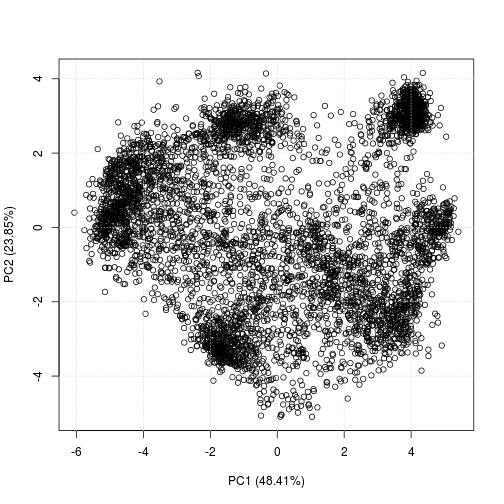
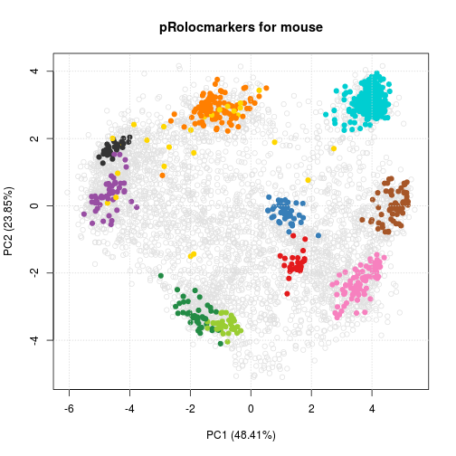
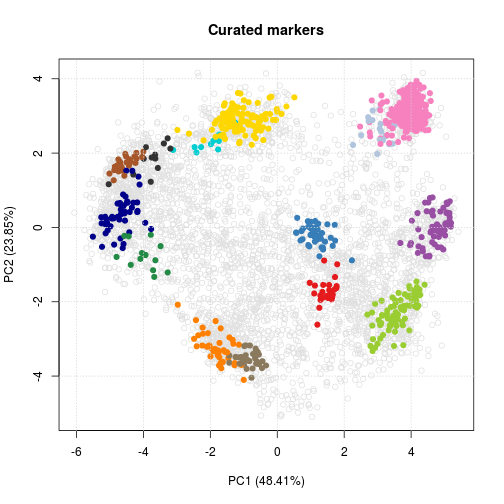
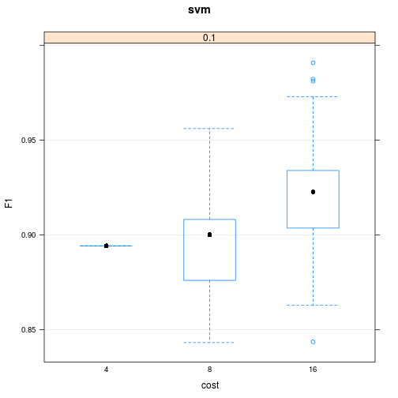
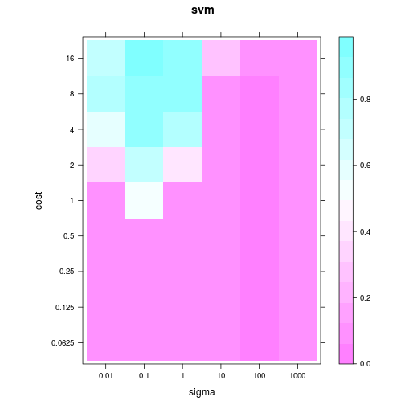

```
## Warning in .recacheSubclasses(def@className, def, doSubclasses, env):
## undefined subclass "daboostCont" of class "listOrdata.frame"; definition
## not updated
```

```
## Warning in .recacheSubclasses(def@className, def, doSubclasses, env):
## undefined subclass "daboostCont" of class "input"; definition not updated
```

```
## Warning in .recacheSubclasses(def@className, def, doSubclasses, env):
## undefined subclass "daboostCont" of class "output"; definition not updated
```

# Introduction

Quantitative mass spectrometry based spatial proteomics involves
elaborate, expensive and time consuming experimental procedures and
considerable effort is invested in the generation of such
data. Multiple research groups have described a variety of approaches
to establish high quality proteome-wide datasets. However, data
analysis is as critical as data production for reliable and insightful
biological interpretation. Here, we walk the reader through a typical
pipeline for the analysis of such data using several Bioconductor
packages for the R statistical programming environment.

The main package to analyse protein localisation data is
*[pRoloc](http://bioconductor.org/packages/pRoloc)*, which offers a set of dedicated functions for the
analysis of such data. *[pRoloc](http://bioconductor.org/packages/pRoloc)* itself relies on *[MSnbase](http://bioconductor.org/packages/MSnbase)* to
manipulate and process quantitative proteomics data. Many other
packages are used by *[pRoloc](http://bioconductor.org/packages/pRoloc)* for clustering, classification and
visualisation.

In this workflow, we will describe how to prepare the spatial
proteomics data starting from a spreadsheet containing quantitative
mass spectrometry data. We will focus on a recent pluripotent mouse
embryonic stem cells experiment [@hyper]. Additional annotated and
pre-formatted datasets from various species are readily available in
the *[pRolocdata](http://bioconductor.org/packages/pRolocdata)* package.

Installation of Bioconductor package is documented in details on the
[Bioconductor installation help page](http://bioconductor.org/install/#install-bioconductor-packages). This
procedure is also applicable to any packages, from
[CRAN](https://cran.r-project.org/) as well as GitHub. Once a package
has been installed, it needs to be loaded for it functionality become
available in the R session; this is done with the `library` function.

If you have questions about this workflow in particular, or about
other Bioconductor packages in general, they a best asked on the
[Bioconductor support site](https://support.bioconductor.org/)
following the
[posting guidelines](http://www.bioconductor.org/help/support/posting-guide/). Questions
can be tagged with specific package names or keywords. For more
general information about mass spectrometry and proteomics, the
readers are invited to read the *[RforProteomics](http://bioconductor.org/packages/RforProteomics)*
package vignettes and associated papers [@Gatto:2014;@Gatto2015]. 


# Reading and handling mass-spectrometry based proteomics data

## The use-case: prediction sub-cellular localisation in pluripotent embryonic mouse stem cells

As a use-case, we analyse a recent high-throughput spatial proteomics
dataset from pluripotent mouse embryonic stem cells (E14TG2a)
[@hyper]. The data was generated using hyperplexed LOPIT (hyperLOPIT),
an improved method relying on improved sub-cellular fractionation and
more acurate quantitation, leading to more reliable classification of
protein localisation across the whole sub-cellular space. The method
uses an elaborate sub-cellular fractionation scheme, enabled by the
use of Tandem Mass Tag (TMT) [Thompson:2003] 10-plex and application
of the MS data acquisition technique named synchronous precursor
selection MS$^3$ (SPS-MS$^3$) [@McAlister:2014], for TMT
quantification with high accuracy and precision. Three biological
replicates were generated from the E14TG2a experiment, the first was
to target low density fractions and the second and third were to
emphasis separation of the denser organelles.  The intersect of
replicates 1 and 2 was treated as a 20-plex dataset for the analysis
discussed in the manuscript [@hyper] as it has been shown that
combining replicates across from different gradients can increase
spatial resolution [@trotter]. The combination of replicates resulted
in 5032 proteins common in both experiments.

These, as well as many other data are directly available as properly
structured and annotated computational object from the 
*[pRolocdata](http://bioconductor.org/packages/pRolocdata)* experiment package. In this workflow, we
will start with a description of how to generate these ad hoc objects
starting from any arbitrary spreadsheets, as produced by many popular
third-party applications. 

While we focus here on a LOPIT-type dataset, these analyses are
relevant for any quantitative spatial proteomics data, irrespective of
the fractionation or quantitation (i.e. labeled or label-free)
methods.

## The infrastructure: *[pRoloc](http://bioconductor.org/packages/pRoloc)* and *[MSnbase](http://bioconductor.org/packages/MSnbase)* in Bioconductor

To make use of the full functionality of the *[pRoloc](http://bioconductor.org/packages/pRoloc)*
software one needs to import their data into R and prepare them as an
`MSnSet`. The `MSnSet` is a dedicated data structure for the efficient
manipulation and processing of mass spectrometry and proteomics data
in R. Figure 1 illustrates a simplified view of the `MSnSet`
structure; there exists 3 key sub-parts (termed slots) to such a data
object: (1) the `exprs` slot for storing the quantitation data, (2)
the `fData` slot for storing the feature meta-data, and finally (3)
the `pData` slot for storing the sample meta-data.

* vignette)](./Figures/msnset.png)

There are a number of ways to import quantitation data and create an
`MSnSet` instance and all methods are described in the `r
Biocpkg("MSnbase")`
[input/output capabilities vignette](http://bioconductor.org/packages/release/bioc/vignettes/MSnbase/inst/doc/MSnbase-io.pdf). One
suggested simple method is to use the function `readMSnSet2` in 
*[MSnbase](http://bioconductor.org/packages/MSnbase)*. The function takes a single spreadsheet as input
and extracts the columns containing the quantitation data, as
identified by the argument `ecol`, to create the expression data,
while the other columns in the spreadsheet are appended to the feature
meta-data slot.  By example, in the code chunk below we read in the
`csv` spreadsheet containing the quantitation data from the intersect
of replicates 1 and 2 of the mouse map [@hyper], using the
`readMSnSet2` function. The data is as available online with the
manuscript (see tab 2 of the `xlsx` supplementary data set 1 in
[@hyper], which should be exported as a text-based spreadsheet) and
also as a `csv` in the Bioconductor *[pRolocdata](http://bioconductor.org/packages/pRolocdata)* data
package.

To use the `readMSnSet2` function, as a minimum one must specify the
file path to the data and which columns of the spreadsheet contain
quantitation data. The `getEcols` function exists to help users
identify which columns of the spreadsheet contain the
quantitation data. 

We first locate the the spreadsheet of E14TG2a data distributed with
the *[pRolocdata](http://bioconductor.org/packages/pRolocdata)* data using `system.file`, that
locates the `extdata` in the *[pRolocdata](http://bioconductor.org/packages/pRolocdata)* package on
the hard drive and `dir`, that displays the full path to the file
matching the `hyperLOPIT-SIData-ms3-rep12-intersect.csv` pattern,
which corresponds the the file of interest. In the last line, we print
the filename (not the full path, which will vary from computer to
computer). 


```r
library("MSnbase")
extdatadir <- system.file("extdata", package = "pRolocdata")
csvfile <- dir(extdatadir, full.names = TRUE,
          pattern = "hyperLOPIT-SIData-ms3-rep12-intersect.csv")
basename(csvfile)
```

```
## [1] "hyperLOPIT-SIData-ms3-rep12-intersect.csv.gz"
```

Note that the file is compressed (as indicated by the `gz`, for
`gzip`, extension), and will be decompressed on-the-fly when read into
R later on.

The spreadsheet that was deposited by the authors contains two
headers, with the second header containing information about where the
quantitation data is stored. We can display the names of the second
header by calling the `getEcols` function with the argument `n = 2`
(the default value is `n = 1`), to specify that we wish to display the
column names of the second line.


```r
getEcols(csvfile, split = ",", n = 2)
```

```
##  [1] ""                                 
##  [2] ""                                 
##  [3] ""                                 
##  [4] "Experiment 1"                     
##  [5] "Experiment 2"                     
##  [6] "Experiment 1"                     
##  [7] "Experiment 2"                     
##  [8] "126"                              
##  [9] "127N"                             
## [10] "127C"                             
## [11] "128N"                             
## [12] "128C"                             
## [13] "129N"                             
## [14] "129C"                             
## [15] "130N"                             
## [16] "130C"                             
## [17] "131"                              
## [18] "126"                              
## [19] "127N"                             
## [20] "127C"                             
## [21] "128N"                             
## [22] "128C"                             
## [23] "129N"                             
## [24] "129C"                             
## [25] "130N"                             
## [26] "130C"                             
## [27] "131"                              
## [28] "phenoDisco Input"                 
## [29] "phenoDisco Output"                
## [30] "Curated phenoDisco Output"        
## [31] "SVM marker set"                   
## [32] "SVM classification"               
## [33] "SVM score"                        
## [34] "SVM classification (top quartile)"
## [35] "Final Localization Assignment"    
## [36] "First localization evidence?"     
## [37] "Curated Organelles"               
## [38] "Cytoskeletal Components"          
## [39] "Trafficking Proteins"             
## [40] "Protein Complexes"                
## [41] "Signaling Cascades"               
## [42] "Oct4 Interactome"                 
## [43] "Nanog Interactome"                
## [44] "Sox2 Interactome"                 
## [45] "Cell Surface Proteins"
```

It is now easy for one to
identify that the quantitation data is located in columns 8 to 27. It
is also possible to pass the optional argument `fnames` to indicate
which column to use as the labels by which to identify each protein in
the sample. Here, we use `fnames = 1` to use the Uniprot identifiers
contained in the first column of the spreadsheet.


```r
lopit2016 <- readMSnSet2(csvfile, ecol = c(8:27), fnames = 1, skip = 1, 
                         stringsAsFactors = FALSE)


## Note: arguments can be passed to read.table and friends using ...
## here we use skip = 1 to tell readMSnSet2 to skip 1 line before
## beginning to read data.

## Examine the quantitative information for first 5 proteins 
exprs(lopit2016)[1:5, ]
```

```
##           X126 X127N X127C X128N X128C X129N X129C X130N X130C  X131
## Q9JHU4   0.028 0.034 0.024 0.014 0.026 0.045 0.107 0.341 0.059 0.321
## Q9QXS1-3 0.039 0.134 0.095 0.053 0.084 0.121 0.107 0.128 0.122 0.117
## Q9ERU9   0.021 0.013 0.014 0.009 0.024 0.054 0.116 0.257 0.209 0.284
## P26039   0.120 0.255 0.148 0.091 0.135 0.095 0.041 0.057 0.014 0.043
## Q8BTM8   0.055 0.139 0.078 0.050 0.077 0.098 0.093 0.171 0.079 0.160
##          X126.1 X127N.1 X127C.1 X128N.1 X128C.1 X129N.1 X129C.1 X130N.1
## Q9JHU4    0.037   0.064   0.058   0.059   0.067   0.078   0.140   0.208
## Q9QXS1-3  0.033   0.073   0.074   0.062   0.081   0.142   0.190   0.069
## Q9ERU9    0.026   0.017   0.023   0.029   0.039   0.071   0.105   0.171
## P26039    0.111   0.181   0.141   0.144   0.152   0.119   0.075   0.028
## Q8BTM8    0.062   0.108   0.091   0.086   0.099   0.111   0.117   0.095
##          X130C.1 X131.1
## Q9JHU4     0.141  0.147
## Q9QXS1-3   0.151  0.125
## Q9ERU9     0.304  0.215
## P26039     0.017  0.033
## Q8BTM8     0.144  0.087
```

contains 5032 proteins common across the 2 biological replicates for
the respective 2 x 10-plex reporter tags, along with associated
feature meta-data such as protein markers, protein description, number
of quantified peptides etc.

As briefly mentioned above, the quantitation data is stored in the `exprs` slot of the `MSnSet` and can be accessed by `exprs(lopit2016)`. The feature meta-data is stored in the `fData` slot and can be accessed by `fData(lopit2016)`. When using `readMSnSet2`, automatically, everything that is not defined as quantitation data by `ecol` or the feature names by `fnames` is deposited to the `fData` slot. As we wish to demonstrate the complete analysis of this data we remove the results from the prior analysis described in [@hyper] in the code chunk below. We see the `fData` contains 25 columns describing information such as the number of peptides, associated markers, machine learning results etc. For demonstration in the code chunk below keep the 2nd, 8th and 11th columns which contain the Uniprot entry names and two different marker sets to use an input for machine learning analyses (see sections on markers and subsequent sections).


```r
fvarLabels(lopit2016)
```

```
##  [1] "X"                                
##  [2] "X.1"                              
##  [3] "X.2"                              
##  [4] "Experiment.1"                     
##  [5] "Experiment.2"                     
##  [6] "Experiment.1.1"                   
##  [7] "Experiment.2.1"                   
##  [8] "phenoDisco.Input"                 
##  [9] "phenoDisco.Output"                
## [10] "Curated.phenoDisco.Output"        
## [11] "SVM.marker.set"                   
## [12] "SVM.classification"               
## [13] "SVM.score"                        
## [14] "SVM.classification..top.quartile."
## [15] "Final.Localization.Assignment"    
## [16] "First.localization.evidence."     
## [17] "Curated.Organelles"               
## [18] "Cytoskeletal.Components"          
## [19] "Trafficking.Proteins"             
## [20] "Protein.Complexes"                
## [21] "Signaling.Cascades"               
## [22] "Oct4.Interactome"                 
## [23] "Nanog.Interactome"                
## [24] "Sox2.Interactome"                 
## [25] "Cell.Surface.Proteins"
```

```r
fData(lopit2016) <- fData(lopit2016)[, c(2, 8, 11)]
head(fData(lopit2016))
```

```
##                  X.1 phenoDisco.Input     SVM.marker.set
## Q9JHU4   DYHC1_MOUSE          unknown            unknown
## Q9QXS1-3  PLEC_MOUSE          unknown            unknown
## Q9ERU9    RBP2_MOUSE          unknown            unknown
## P26039    TLN1_MOUSE          unknown Actin cytoskeleton
## Q8BTM8    FLNA_MOUSE          unknown            unknown
## A2ARV4    LRP2_MOUSE          unknown            unknown
```

## Data processing

* normalisation
* missing data
* combining acquisistions

Before combination, the two replicates were separately normalised by
sum across the 10 channels (i.e. such that the sum of each protein's
intensity is 1), for each replicate respectively. Normalisation is an
essential part of data processing and several methods are available in
*[MSnbase](http://bioconductor.org/packages/MSnbase)*. The normalisation desired in this specific
case would be obtained with the a call to the `normalise` method.

The combination of data can also be performed effectively in 
*[MSnbase](http://bioconductor.org/packages/MSnbase)* as detailed in the dedicated *Combining MSnSet
instances* section of the *[MSnbase](http://bioconductor.org/packages/MSnbase)*
[tutorial vignette](http://bioconductor.org/packages/release/bioc/vignettes/MSnbase/inst/doc/MSnbase-demo.pdf).


# Quality Control

Data quality is routinely examined through visualisation to verify that sub-cellular niches have been separated along the gradient. Based on De Duve's principle [@DeDuve:1981] proteins that co-localise exhibit similar quantitation profiles across the gradient fractions employed. One approach that has been widely used to visualise and inspect high throughput mass spectrometry-based proteomics data is principal components analysis (PCA). PCA is one of many dimensionality reduction methods, that allow one to effectively summarise multi-dimensional data in to 2 or 3 dimensions to enable visualisation. Very generally, the original continuous multi-dimensional data is transformed into a set of orthogonal components ordered according to the amount of variability that they describe. The `plot2D` method in *[pRoloc](http://bioconductor.org/packages/pRoloc)* allows one to plot the principal components (PCs) of a dataset against one another, by default the first two components are plotted on the x- and y-axis, respectively (the `dims` argument can be used to plot other PCs). If distinct clusters are observed, we assume that there is organellar separation present in the data. In the code chunk below we produce a PCA plot of the mouse stem cell dataset. One point on the plot represents one protein. We can indeed see several distinct protein clusters. Although, plotting the PCs does not give us a hard quantitative measure of separation, it is extremely useful summarising complex experimental information in one figure, to get an simplified overview of the data. 


```r
library('pRoloc')
plot2D(lopit2016, fcol = NULL)
```



# Markers

In the context of spatial proteomics, a marker protein is defined as a well-known resident of a specific sub-cellular niche in a species *and* condition of interest. Applying this to machine learning (ML), and specifically supervised learning, for the task of protein localisation prediction, markers constitute the labelled training data to use as input for a classification analyses. Defining well-known residents, and obtaining labelled training data for ML analyses can be time consuming, but is important to define markers that are representative of the multivariate data space and on which a classifier will be trained and generated. *[pRoloc](http://bioconductor.org/packages/pRoloc)* provides a convenience function, `addMarkers`, to directly add markers to a `MSnSet` object, as demonstrated in the code chunk below. These marker sets can be accessed using the `pRolocmarkers()` function. Marker sets are stored as a simple named vector in R, and originate from in-house user-defined spreadsheets or a set of markers from previous published studies. The marker vectors that can be accessed from `pRolocmarkers` are named vectors and to enable mapping between the markers and the `MSnSet` instance it is required that the `featureNames` of the `MSnSet` instance match the `names` of the marker. The mouse dataset used here has Uniprot IDs stored as the `featureNames` (see `head(featureNames(lopit2016))`) and the names of the vector of the mouse markers (`mmus` markers) are Uniprot entry names (see `head(mrk)` in the code chunk below), therefore it is required we update the `MSnSet` to match the names of the markers, as demonstrated below. It is then possible to match names between the markers and the `MSnSet` instance. We see below that the markers cover many sub-cellular niches, with many niches only containing a few proteins. Depending on the biological question and downstream analyses we may wish the subset these marker classes, this can be done using the `minMarkers` function. In the code chunk below, we demonstrate how to add markers using `pRolocmarkers` function and then visualise these annotations using the `plot2D` function.


```r
## List available marker sets
pRolocmarkers()
```

```
## 7 marker lists available:
## Arabidopsis thaliana [atha]:
##  Ids: TAIR, 543 markers
## Drosophila melanogaster [dmel]:
##  Ids: Uniprot, 179 markers
## Gallus gallus [ggal]:
##  Ids: IPI, 102 markers
## Homo sapiens [hsap]:
##  Ids: Uniprot ID, 205 markers
## Mus musculus [mmus]:
##  Ids: Uniprot ID, 1305 markers
## Saccharomyces cerevisiae [scer_sgd]:
##  Ids: SGD, 259 markers
## Saccharomyces cerevisiae [scer_uniprot]:
##  Ids: Uniprot Accession, 259 markers
```

```r
## Use mouse markers
mrk <- pRolocmarkers(species = "mmus")
head(mrk)
```

```
##      CLD4_MOUSE     CTND1_MOUSE     SCRIB_MOUSE      ITB4_MOUSE 
## "cell junction" "cell junction" "cell junction" "cell junction" 
##      ENOB_MOUSE      PGK2_MOUSE 
##     "cytoplasm"     "cytoplasm"
```

```r
## Change featureNames of the MSnSet to match the marker names 
## which are named by Uniprot Entry Name
featureNames(lopit2016) <- make.unique(fData(lopit2016)[, 1])

## Add mouse markers
lopit2016 <- addMarkers(lopit2016, mrk)
```

```
## Markers in data: 1257 out of 5032
```

```
## organelleMarkers
##                  actin cytoskeleton                 actin cytoskeleton  
##                                  24                                   1 
##            actin cytoskeleton - ARP         actin cytoskeleton - myosin 
##                                   7                                   4 
##                       cell junction                           chromatin 
##                                   3                                  53 
##                           cytoplasm             cytoplasm - EIF complex 
##                                  41                                  30 
##                  cytoplasm - P-body             cytoplasm - tRNA ligase 
##                                  10                                  12 
##           cytoplasm/nuclear shuttle                   cytoplasm/nucleus 
##                                  20                                  52 
##                  cytoplasm/nucleus                         cytoskeleton 
##                                   3                                  12 
##                            endosome                                  ER 
##                                  22                                  80 
##                            ER/golgi                extracellular matrix 
##                                   4                                  11 
##                               Golgi                            lysosome 
##                                  27                                  28 
##                   lysosome/endosome                         microtubule 
##                                  20                                  32 
##              microtubule/centrosome                        mitochondria 
##                                  16                                 262 
##                      nuclear lamina                           nucleolus 
##                                   9                                  50 
##                             nucleus      nucleus - chromatin/centromere 
##                                  45                                   7 
##            nucleus - nuclear matrix          nucleus - nuclear membrane 
##                                   3                                  18 
##           nucleus - nuclear speckle               nucleus - nucleoplasm 
##                                   3                                   1 
##                  nucleus - PML body nucleus - ribonucleoprotein complex 
##                                   1                                  28 
##                          peroxisome                                  PM 
##                                  18                                  50 
##             PM - adherins junctions                  PM - cell junction 
##                                   2                                   8 
##                          proteasome                      ribonucleosome 
##                                  35                                   5 
##                   ribosome 28S (MT)                   ribosome 39S (MT) 
##                                  23                                  37 
##                        ribosome 40S                        ribosome 50S 
##                                  29                                   3 
##                        ribosome 60S                            secreted 
##                                  43                                   2 
##        secreted/extracellular space                             unknown 
##                                  11                                3775 
##                 vesicles - caveolae          vesicles - clathrin coated 
##                                   3                                   3 
##    vesicles - clathrin coated/golgi       vesicles - clathrin coated/PM 
##                                   7                                   3 
##             vesicles - COPI coated             vesicles - COPII coated  
##                                   7                                   3 
##         vesicles - retromer complex            vesicles - SNARE complex 
##                                   9                                  17
```

```r
## Remove marker sets with < 20 proteins
lopit2016 <- minMarkers(lopit2016, n = 20)
getMarkers(lopit2016, fcol = "markers20")
```

```
## organelleMarkers
##                  actin cytoskeleton                           chromatin 
##                                  24                                  53 
##                           cytoplasm             cytoplasm - EIF complex 
##                                  41                                  30 
##           cytoplasm/nuclear shuttle                   cytoplasm/nucleus 
##                                  20                                  52 
##                            endosome                                  ER 
##                                  22                                  80 
##                               Golgi                            lysosome 
##                                  27                                  28 
##                   lysosome/endosome                         microtubule 
##                                  20                                  32 
##                        mitochondria                           nucleolus 
##                                 262                                  50 
##                             nucleus nucleus - ribonucleoprotein complex 
##                                  45                                  28 
##                                  PM                          proteasome 
##                                  50                                  35 
##                   ribosome 28S (MT)                   ribosome 39S (MT) 
##                                  23                                  37 
##                        ribosome 40S                        ribosome 60S 
##                                  29                                  43 
##                             unknown 
##                                4001
```

```r
plot2D(lopit2016, fcol = "markers20", main = "pRolocmarkers for mouse")
```



```r
## After expert curation
plot2D(lopit2016, fcol = "SVM.marker.set", main = "Curated markers")
```



In general, the Gene Ontology (GO) [@Ashburner:2000], and in particular the cellular compartment (CC) namespace are a good starting point for protein annotation and marker definition. It is important to note however that automatic retrieval of sub-cellular localisation information, from *[pRoloc](http://bioconductor.org/packages/pRoloc)* or elsewhere, is only the beginning in defining a marker set for downstream analyses. Expert curation is vital to check that any annotation added is in the correct context for the the biological question under investigation. In the code chunk above we show the PCA plot output of the mouse dataset with (i) the annotation for mouse pulled from `pRolocmarkers`, and (ii) annotation after expert curation (stored in the `featureData` column called `SVM.marker.set` that was used for a classification analyses in the original data analyses [@hyper]).

# Interactive visualisation


# Novelty Detection

The extraction of sub-cellular protein clusters can be difficult owing to the limited number of marker proteins that exist in databases and elsewhere. Furthermore, given the vast complexity of the cell, automatic annotation retrieval does not always give a full representation of the true sub-cellular diversity in the data. For downstream analyses, such as supervised machine learning, it is desirable to obtain reliable markers that cover as many sub-cellular niches as possible, as these markers are directly used in the training phase of the ML classification. We find that a lack of sub-cellular diversity in the labelled training data leads to prediction errors, as unlabelled instances can only be assigned to a class that exists in the training data [@Breckels:2013]. In such scenarios novelty detection can be useful to identify data-specific sub-cellular groupings such as organelles and protein complexes. The phenotype discovery (phenoDisco) algorithm [@Breckels:2013] is one such method and is available in *[pRoloc](http://bioconductor.org/packages/pRoloc)*. It is an iterative semi-supervised learning method that combines the classification of proteins on existing labelled data with the detection of new clusters. Novelty detection methods are also useful for confirming the presence of known clusters in an unbiased fashion. For example, in [@hyper] the `phenoDisco` algorithm was used to detect the data-specific confirmation and presence of the nucleus and nucleus sub-compartments, as it was expected that nucleus associated clusters existed within the data as the protocol included a separate chromatin-rich fraction to enrich for nuclei. In the code chunk below, we show how to run a series of novelty detection experiments using the `phenoDisco` algorithm on the mouse stem-cell dataset. There are several optional arguments that can be set dependent on the type of biological question of interest. For example, 

- Explain how to use different group sizes for detecting small complexes etc.
- ndims for using >=2 components
- times -> important for convergence
- input markers are different here -> explain choice of pd.markers


```r
## As per the hyperLOPIT paper
pdRes <- phenoDisco(lopit2016, fcol = "phenoDisco.Input", times = 200, 
                    GS = 20, p = 0.05)
```

# Supervised machine learning

Supervised machine learning, also known as classification, is an essential tool for the assignment of proteins to distinct sub-cellular niches. Using a set of labelled training examples i.e. markers, we can train a machine learning classifier to learn a mapping between the data i.e. the quantitative protein profiles, and a known localisation. The trained classifier can then be used to predict the localisation of a protein of unknown localisation, based on its observed protein profile. To date, this method has been extensively used in spatial quantitative proteomics to assign thousands of proteins to distinct sub-cellular niches [@hyper; @Groen:2014; @trotter; @Hall:2009; @Dunkley:2006; @Tan:2009]. 

There are several classification algorithms available in `pRoloc`, which are documented in the dedicated [`pRoloc` Machine learning techniques vignette](http://bioconductor.org/packages/release/bioc/vignettes/pRoloc/inst/doc/pRoloc-ml.pdf). We find the general tendancy to be that it is not the choice of classifier but the proper optimisation of the algorithms parameters that limit the classification results. Before employing a classification algorithm and generating a model on the training data with which to classify our set of unknown residents, one must find the optimal parameters for the algorithm of choice. For example, in the code chunk below we employ the use of a Support Vector Machine (SVM) to learn a classifier on the labelled training data. In the example below, the training data is found in the `featureData` slot in the column called `SVM.marker.set`.

Notes:
- take care of properly setting the model parameters. 
- Wrongly set parameters can have adverse effects 
- how well they represent the multivariate data?
- Parameter optimisation can be conducted in a number of ways. One of the most common is train/test plus 5-fold x-val


```r
w <- table(fData(pdRes)[, "SVM.marker.set"])
w <- 1/w[names(w) != "unknown"]

params <- svmOptimisation(pdRes, fcol = "SVM.marker.set",
                          times = 100, xval = 5,
                          class.weights = w,
                          verbose = TRUE)
```

```r
plot(params)
```



```r
levelPlot(params)
```



```r
(best <- getParams(params))
```

```
## sigma  cost 
##   0.1  16.0
```

```r
svmRes <- svmClassification(pdRes, params,
                            class.weights = w,
                            fcol = "SVM.marker.set")
```

```
## Error in svm.default(x, y, scale = scale, ..., na.action = na.action): object 'w' not found
```


## Transfer learning

# Session information

The function `sessionInfo` provides a summary of all packages and
versions used to generate this document. This enables us to record the
exact state of our session that lead to these exact
results. Conversely, if the script stops working of if it returns
different results, we are in a position to re-generate the original
results using the adequate software versions and retrace changes in
the software that lead to failure and/or different results.


```r
sessionInfo()
```

```
## R Under development (unstable) (2016-05-11 r70599)
## Platform: x86_64-pc-linux-gnu (64-bit)
## Running under: Ubuntu 14.04.4 LTS
## 
## locale:
##  [1] LC_CTYPE=en_GB.UTF-8       LC_NUMERIC=C              
##  [3] LC_TIME=en_GB.UTF-8        LC_COLLATE=en_GB.UTF-8    
##  [5] LC_MONETARY=en_GB.UTF-8    LC_MESSAGES=en_GB.UTF-8   
##  [7] LC_PAPER=en_GB.UTF-8       LC_NAME=C                 
##  [9] LC_ADDRESS=C               LC_TELEPHONE=C            
## [11] LC_MEASUREMENT=en_GB.UTF-8 LC_IDENTIFICATION=C       
## 
## attached base packages:
## [1] stats4    parallel  methods   stats     graphics  grDevices utils    
## [8] datasets  base     
## 
## other attached packages:
##  [1] pRoloc_1.13.2        MLInterfaces_1.53.0  cluster_2.0.4       
##  [4] annotate_1.51.0      XML_3.98-1.4         AnnotationDbi_1.35.3
##  [7] IRanges_2.7.1        S4Vectors_0.11.2     MSnbase_1.21.6      
## [10] ProtGenerics_1.5.0   BiocParallel_1.7.2   mzR_2.7.3           
## [13] Rcpp_0.12.5          Biobase_2.33.0       BiocGenerics_0.19.0 
## [16] BiocStyle_2.1.2      knitr_1.13          
## 
## loaded via a namespace (and not attached):
##  [1] nlme_3.1-128          pbkrtest_0.4-6        bitops_1.0-6         
##  [4] doParallel_1.0.10     RColorBrewer_1.1-2    threejs_0.2.2        
##  [7] prabclus_2.2-6        ggvis_0.4.2           tools_3.4.0          
## [10] R6_2.1.2              affyio_1.43.0         rpart_4.1-10         
## [13] mgcv_1.8-12           DBI_0.4-1             colorspace_1.2-6     
## [16] trimcluster_0.1-2     nnet_7.3-12           gbm_2.1.1            
## [19] preprocessCore_1.35.0 quantreg_5.24         formatR_1.4          
## [22] SparseM_1.7           diptest_0.75-7        scales_0.4.0         
## [25] sfsmisc_1.1-0         DEoptimR_1.0-4        mvtnorm_1.0-5        
## [28] robustbase_0.92-5     randomForest_4.6-12   genefilter_1.55.2    
## [31] affy_1.51.0           proxy_0.4-15          stringr_1.0.0        
## [34] digest_0.6.9          minqa_1.2.4           base64enc_0.1-3      
## [37] htmltools_0.3.5       lme4_1.1-12           rda_1.0.2-2          
## [40] limma_3.29.5          htmlwidgets_0.6       RSQLite_1.0.0        
## [43] impute_1.47.0         FNN_1.1               BiocInstaller_1.23.4 
## [46] shiny_0.13.2          hwriter_1.3.2         jsonlite_0.9.20      
## [49] mzID_1.11.2           mclust_5.2            gtools_3.5.0         
## [52] car_2.1-2             dplyr_0.4.3           RCurl_1.95-4.8       
## [55] magrittr_1.5          modeltools_0.2-21     MALDIquant_1.14      
## [58] Matrix_1.2-6          munsell_0.4.3         vsn_3.41.0           
## [61] stringi_1.0-1         MASS_7.3-45           zlibbioc_1.19.0      
## [64] flexmix_2.3-13        plyr_1.8.3            grid_3.4.0           
## [67] pls_2.5-0             gdata_2.17.0          lattice_0.20-33      
## [70] splines_3.4.0         fpc_2.1-10            lpSolve_5.6.13       
## [73] reshape2_1.4.1        codetools_0.2-14      biomaRt_2.29.2       
## [76] evaluate_0.9          pcaMethods_1.65.0     mlbench_2.1-1        
## [79] nloptr_1.0.4          httpuv_1.3.3          foreach_1.4.3        
## [82] MatrixModels_0.4-1    gtable_0.2.0          kernlab_0.9-24       
## [85] assertthat_0.1        ggplot2_2.1.0         mime_0.4             
## [88] xtable_1.8-2          e1071_1.6-7           class_7.3-14         
## [91] survival_2.39-4       iterators_1.0.8       rgl_0.95.1441        
## [94] caret_6.0-68          sampling_2.7
```

It is always important to include session information details along
with a
[short reproducible example](http://adv-r.had.co.nz/Reproducibility.html)
highlighting the problem or
[question](https://support.bioconductor.org/) at hand.
